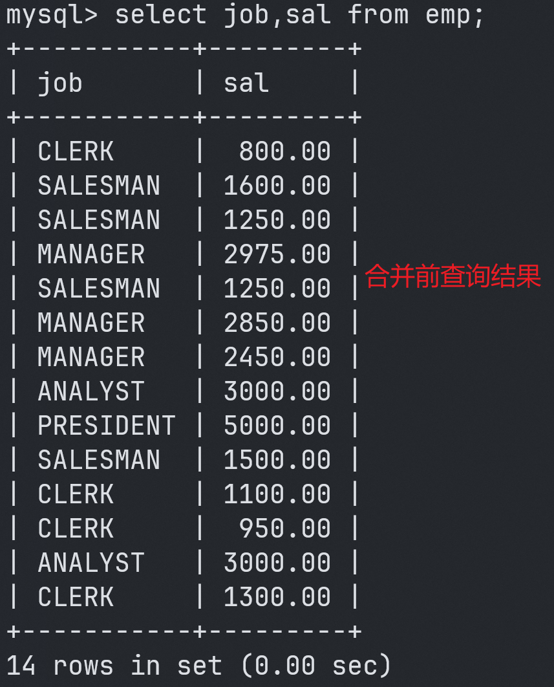

# MySQL | DQL语句-子查询


---

## 什么是子查询

::: tip 提示
1. select语句中`嵌套select语句`就叫做`子查询`。
2. select语句可以嵌套在哪里？
   1. `where后面、from后面、select后面`都是可以的。
:::

```sql [SQL]
select ..(select)..
from ..(select)..
where ..(select)..
```


## where后面使用子查询

> 案例：找出`高于平均薪资`的`员工姓名和薪资`。

>> **`错误的示范`：**

```sql [SQL]
mysql> select ename,sal from emp where sal > avg(sal);

ERROR 1111 (HY000): Invalid use of group function
```
>> **错误原因：`where后面不能`直接使用`分组函数`。**

>> **`正确的示范`：**

1. 找出平均薪资：


```sql [SQL]
mysql> 第一步: 找出平均薪资 \c
mysql> select avg(sal) from emp;
+-------------+
| avg(sal)    |
+-------------+
| 2073.214286 |
+-------------+
1 row in set (0.01 sec)
```

2. 找出高于平均薪资的员工：


```sql [SQL]
mysql> 第二步: 找出高于平均薪资的员工 \c
mysql> select ename,sal from emp where sal > 2073.214286;
+-------+---------+
| ename | sal     |
+-------+---------+
| JONES | 2975.00 |
| BLAKE | 2850.00 |
| CLARK | 2450.00 |
| SCOTT | 3000.00 |
| KING  | 5000.00 |
| FORD  | 3000.00 |
+-------+---------+
6 rows in set (0.00 sec)
```

>> **`可以使用子查询`：**

```sql [SQL]
mysql> select ename,sal from emp where sal > (select avg(sal) from emp);

+-------+---------+
| ename | sal     |
+-------+---------+
| JONES | 2975.00 |
| BLAKE | 2850.00 |
| CLARK | 2450.00 |
| SCOTT | 3000.00 |
| KING  | 5000.00 |
| FORD  | 3000.00 |
+-------+---------+
6 rows in set (0.01 sec)
```


## from后面使用子查询

> **小窍门：from后面的`子查询`可以`看做一张临时表`。**

>> **案例：找出`每个部门`的`平均工资的等级`。**

>> **第一步：先找出`每个部门平均工资`。**

```sql [SQL]
mysql> 第一步: 找出每个部门的平均工资 \c
mysql> select deptno,avg(sal) as avgsal from emp group by deptno; //找出每个部门平均工资
+--------+-------------+
| deptno | avgsal      |
+--------+-------------+
|     20 | 2175.000000 |
|     30 | 1566.666667 |
|     10 | 2916.666667 |
+--------+-------------+
3 rows in set (0.01 sec)

mysql> select * from salgrade;  //查看工资等级表
+-------+-------+-------+
| GRADE | LOSAL | HISAL |
+-------+-------+-------+
|     1 |   700 |  1200 |
|     2 |  1201 |  1400 |
|     3 |  1401 |  2000 |
|     4 |  2001 |  3000 |
|     5 |  3001 |  9999 |
+-------+-------+-------+
5 rows in set (0.00 sec)
```


>> **第二步：将以上查询结果当做临时表t，t表和salgrade表进行连接查询。条件：t.avgsal between s.losal and s.hisal**

```sql [SQL]
mysql> 第二步：将以上查询结果当做临时表t，t表和salgrade表进行连接查询。条件：t.avgsal between s.losal and s.hisal \c

mysql> select t.*,s.grade from (select deptno, avg(sal) avgsal from emp group by deptno) t join salgrade s on t.avgsal between s.losal and s.hisal;

+--------+-------------+-------+
| deptno | avgsal      | grade |
+--------+-------------+-------+
|     20 | 2175.000000 |     4 |
|     30 | 1566.666667 |     3 |
|     10 | 2916.666667 |     4 |
+--------+-------------+-------+
3 rows in set (0.01 sec)
```


## select后面使用子查询

```sql [SQL]
mysql> select e.ename,(select d.dname from dept d where e.deptno=d.deptno) as dname from emp e;

+--------+------------+
| ename  | dname      |
+--------+------------+
| SMITH  | RESEARCH   |
| ALLEN  | SALES      |
| WARD   | SALES      |
| JONES  | RESEARCH   |
| MARTIN | SALES      |
| BLAKE  | SALES      |
| CLARK  | ACCOUNTING |
| SCOTT  | RESEARCH   |
| KING   | ACCOUNTING |
| TURNER | SALES      |
| ADAMS  | RESEARCH   |
| JAMES  | SALES      |
| FORD   | RESEARCH   |
| MILLER | ACCOUNTING |
+--------+------------+
14 rows in set (0.01 sec)
```


## exists、not exists

::: tip 提示
在 MySQL 数据库中，`EXISTS（存在）`用于`检查子查询的查询结果行数是否大于0`。如果`子查询的查询结果行数大于0`，则 `EXISTS 条件为真`。**(`即存在查询结果则是true`。)**

> **主要应用场景：**

- EXISTS 可以与 `SELECT、UPDATE、DELETE` 一起使用，用于检查另一个查询是否返回任何行；
- EXISTS 可以`用于验证条件子句中的表达式是否存在`；
- EXISTS 常用于`子查询条件过滤`，例如`查询有订单的用户`等。
:::


```sql [SQL]
drop table if exists t_customer;
drop table if exists t_order;

create table t_customer(
  customer_id int,
  customer_name varchar(32)
);

create table t_order(
  order_id int,
  order_price decimal(5,1),
  customer_id int
);

insert into t_customer(customer_id,customer_name) values(1,'zhangsan');
insert into t_customer(customer_id,customer_name) values(2,'lisi');
insert into t_customer(customer_id,customer_name) values(3,'wangwu');

insert into t_order(order_id, order_price, customer_id) values(10, 1000.0, 1);
insert into t_order(order_id, order_price, customer_id) values(20, 2000.0, 1);
insert into t_order(order_id, order_price, customer_id) values(30, 3000.0, 2);
insert into t_order(order_id, order_price, customer_id) values(40, 4000.0, 2);

commit;
select * from t_customer;
select * from t_order;
```

```sql [SQL]
mysql> select * from t_customer; //查询顾客表

+-------------+---------------+
| customer_id | customer_name |
+-------------+---------------+
|           1 | zhangsan      |
|           2 | lisi          |
|           3 | wangwu        |
+-------------+---------------+
3 rows in set (0.00 sec)

mysql> select * from t_order; //查询订单表

+----------+-------------+-------------+
| order_id | order_price | customer_id |
+----------+-------------+-------------+
|       10 |      1000.0 |           1 |
|       20 |      2000.0 |           1 |
|       30 |      3000.0 |           2 |
|       40 |      4000.0 |           2 |
+----------+-------------+-------------+
4 rows in set (0.00 sec)
```

> **现在我们来看一个简单的案例，假设我们要查询先前有过订单的顾客，而`订单信息`保存在`t_order表`中，`顾客信息`保存在`t_customer表`中。我们可以使用以下 sql 语句：**

```sql [SQL]
mysql> select * from t_customer c where exists(select * from t_order o where o.customer_id=c.customer_id);

+-------------+---------------+
| customer_id | customer_name |
+-------------+---------------+
|           1 | zhangsan      |
|           2 | lisi          |
+-------------+---------------+
2 rows in set (0.00 sec)
```
> **在这个查询语句中，子查询用于检查是否有订单与每个客户相关联。如果子查询返回至少一行，则表示该顾客已经下过订单，并返回此客户的所有信息，否则该顾客将不被包含在结果中。**

::: tip 提示
> **以下是这个查询语句的`执行过程`：**

1.  首先查询表 `t_customer` 中的`所有顾客信息`（以下简称为顾客表）； 
2.  对于`顾客表中的每一行`，都`执行一次子查询`，子查询`查询该顾客有没有订单`，如果有，则在结果`集中保留该顾客信息`；如果没有，则将`该顾客排除`； 
3.  最终`返回有订单顾客的所有信息`。 
:::

**除了 EXISTS，也可以使用 NOT EXISTS 条件从 SELECT、UPDATE、DELETE 语句中获取子查询的返回结果。NOT EXISTS 用于检查一个子查询是否返回任何行，如果没有行返回，那么 NOT EXISTS 将返回 true。**

> **例如，我们想要查找所有`没有下过订单的顾客`，可以使用以下 sql 语句：**

```sql [SQL]
mysql> select * from t_customer c where not exists(select * from t_order o where o.customer_id=c.customer_id);

+-------------+---------------+
| customer_id | customer_name |
+-------------+---------------+
|           3 | wangwu        |
+-------------+---------------+
1 row in set (0.00 sec)
```

**在这个查询语句中，如果没有任何与顾客相关联的订单，则 NOT EXISTS 子查询将返回一个空结果集，这时候 WHERE 条件为 true，并将返回所有顾客信息。如果顾客有订单，则 NOT EXISTS 子查询的结果集将不为空，WHERE 条件为 false，则不会返回该顾客的信息。**

> **总之，无论是EXISTS还是NOT EXISTS，都是非常有用的 SQL 工具。可以通过它们来结合子查询来动态过滤查询结果，使 SQL 查询变得更加灵活和高效。**


## in和exists区别

::: tip 提示
> **IN 和 EXISTS 都是用于`关系型数据库查询`的操作符。不同之处在于：**

1.  **IN 操作符是根据指定列表中的`值来判断是否满足条件`，而 EXISTS 操作符则是根据子查询的结果`是否有返回记录集来判断`。**
2.  **EXISTS 操作符通常比 IN 操作符`更快`，尤其是在子查询返回记录数很大的情况下。因为 EXISTS 只需要`判断是否存在符合条件的记录`，而 IN 操作符需要`比对整个列表，因此执行效率相对较低`。** 
3.  **IN 操作符`可同时匹配多个值`，而 EXISTS `只能匹配一组条件`。** 
:::

> **下面是一个简单的示例，用于演示 IN 和 EXISTS 之间的区别。假设我们有两个表 `orders 和 products`，`orders 表`中记录了`订单信息`，`products 表`中记录了`商品信息`。现在我们想查询`所有“手机”和“平板电脑”`这两种商品中，`至少有一笔订单`销售了 `$1000 以上`的商品：**

>> **使用 `IN 操作符`：**

```sql [SQL]
SELECT *
FROM products
WHERE product_name IN ('手机', '平板电脑')
AND product_id IN (
  SELECT product_id
  FROM orders
  WHERE order_amount > 1000
);
```

>> **使用 `EXISTS 操作符`：**

```sql [SQL]
SELECT *
FROM products
WHERE product_name IN ('手机', '平板电脑')
AND EXISTS (
  SELECT *
  FROM orders
  WHERE orders.product_id = products.product_id
  AND order_amount > 1000
);
```
> **总之，`IN 和 EXISTS `都是`用于条件过滤的操作符`，但其实现方式和性能特点都不同，需要根据具体情况进行选择和使用。**


## union & union all

::: tip 提示
**不管是`union还是union all`都可以`将两个查询结果集进行合并`。**

`union`会对`合并之后`的`查询结果集进行去重`操作。

`union all`是直接将`查询结果集合并`，**`不进行去重操作`**。(union all和union都可以完成的话，`优先选择union all`，**union all因为`不需要去重`，所以`效率高一些`**。)
:::




> **案例：查询`工作岗位`是`MANAGER`和`SALESMAN`的`员工`。**

>> **`原始查询结果`：**

```sql [SQL]
mysql> select ename,sal from emp where job='SALESMAN';
+--------+---------+
| ename  | sal     |
+--------+---------+
| ALLEN  | 1600.00 |
| WARD   | 1250.00 |
| MARTIN | 1250.00 |
| TURNER | 1500.00 |
+--------+---------+
4 rows in set (0.00 sec)

mysql> select ename,sal from emp where job='MANAGER';
+-------+---------+
| ename | sal     |
+-------+---------+
| JONES | 2975.00 |
| BLAKE | 2850.00 |
| CLARK | 2450.00 |
+-------+---------+
3 rows in set (0.00 sec)
```

>> **使用`or`：**

```sql [SQL]
mysql> select ename,sal from emp where job='MANAGER' or job='SALESMAN';

+--------+---------+
| ename  | sal     |
+--------+---------+
| ALLEN  | 1600.00 |
| WARD   | 1250.00 |
| JONES  | 2975.00 |
| MARTIN | 1250.00 |
| BLAKE  | 2850.00 |
| CLARK  | 2450.00 |
| TURNER | 1500.00 |
+--------+---------+
7 rows in set (0.00 sec)
```

>> **使用`union all`：**

```sql [SQL]
mysql> select ename,sal from emp where job='MANAGER'
    -> union all
    -> select ename,sal from emp where job='SALESMAN';

+--------+---------+
| ename  | sal     |
+--------+---------+
| JONES  | 2975.00 |
| BLAKE  | 2850.00 |
| CLARK  | 2450.00 |
| ALLEN  | 1600.00 |
| WARD   | 1250.00 |
| MARTIN | 1250.00 |
| TURNER | 1500.00 |
+--------+---------+
7 rows in set (0.00 sec)
```
> **以上案例采用or也可以完成，那or和union all有什么区别？`考虑走索引优化`之类的`选择union all`，其它`选择or`。**

> **两个`结果集合并`时，`列数量要相同`：**


## limit

::: tip 提示
1. limit作用：查询`第几条到第几条`的记录。通常是因为`表中数据量太大，需要分页显示`。
2. limit语法格式：
   1. limit `开始下标`, `长度`
:::

3. **案例：查询员工表`前5条记录`**

```sql [SQL]
mysql> select * from emp limit 0,5;

+-------+--------+----------+------+------------+---------+---------+--------+
| EMPNO | ENAME  | JOB      | MGR  | HIREDATE   | SAL     | COMM    | DEPTNO |
+-------+--------+----------+------+------------+---------+---------+--------+
|  7369 | SMITH  | CLERK    | 7902 | 1980-12-17 |  800.00 |    NULL |     20 |
|  7499 | ALLEN  | SALESMAN | 7698 | 1981-02-20 | 1600.00 |  300.00 |     30 |
|  7521 | WARD   | SALESMAN | 7698 | 1981-02-22 | 1250.00 |  500.00 |     30 |
|  7566 | JONES  | MANAGER  | 7839 | 1981-04-02 | 2975.00 |    NULL |     20 |
|  7654 | MARTIN | SALESMAN | 7698 | 1981-09-28 | 1250.00 | 1400.00 |     30 |
+-------+--------+----------+------+------------+---------+---------+--------+
5 rows in set (0.00 sec)
```
> **如果`下标是从0开始`，可以`简写`为：**
```sql [SQL]
mysql> select * from emp limit 5;

+-------+--------+----------+------+------------+---------+---------+--------+
| EMPNO | ENAME  | JOB      | MGR  | HIREDATE   | SAL     | COMM    | DEPTNO |
+-------+--------+----------+------+------------+---------+---------+--------+
|  7369 | SMITH  | CLERK    | 7902 | 1980-12-17 |  800.00 |    NULL |     20 |
|  7499 | ALLEN  | SALESMAN | 7698 | 1981-02-20 | 1600.00 |  300.00 |     30 |
|  7521 | WARD   | SALESMAN | 7698 | 1981-02-22 | 1250.00 |  500.00 |     30 |
|  7566 | JONES  | MANAGER  | 7839 | 1981-04-02 | 2975.00 |    NULL |     20 |
|  7654 | MARTIN | SALESMAN | 7698 | 1981-09-28 | 1250.00 | 1400.00 |     30 |
+-------+--------+----------+------+------------+---------+---------+--------+
5 rows in set (0.00 sec)
```

4. **查询`工资排名在前5名`的员工(limit是在`order by执行之后`才会`执行`的)**
```sql [SQL]
mysql> select ename,sal from emp order by sal desc limit 5;

+-------+---------+
| ename | sal     |
+-------+---------+
| KING  | 5000.00 |
| SCOTT | 3000.00 |
| FORD  | 3000.00 |
| JONES | 2975.00 |
| BLAKE | 2850.00 |
+-------+---------+
5 rows in set (0.00 sec)
```

5. **通用的`分页sql`**

::: tip 提示
> **假设`每页显示3条记录`：`pageSize = 3`**

```sql [SQL]
第1页：limit 0, 3

第2页：limit 3, 3

第3页：limit 6, 3
```
结论: 第pageNo页：limit (pageNo - 1)*pageSize, pageSize
:::