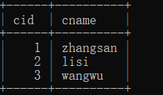
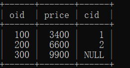
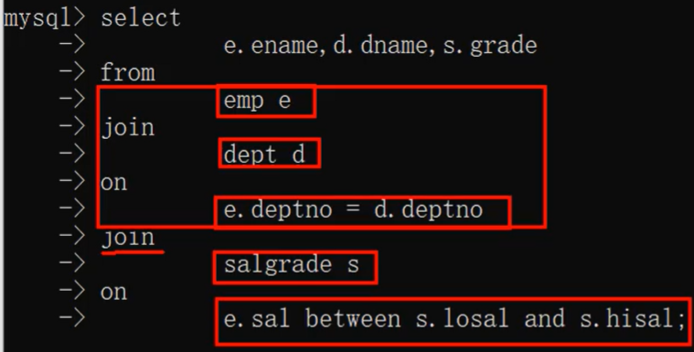

# MySQL | DQL语句-连接查询

## 什么是连接查询

1. 从一张表中查询数据称为单表查询。
2. 从两张或更多张表中联合查询数据称为`多表查询`，又叫做连接查询。
3. 什么时候需要使用连接查询？
   1. 比如这样的需求：`员工表中有员工姓名，部门表中有部门名字，要求查询每个员工所在的部门名字，这个时候就需要连接查询`。
## 连接查询的分类

1. 根据语法出现的年代进行分类：
   1. SQL92（这种语法很少用，可以不用学。）
   2. SQL99（我们主要学习这种语法。）
2. 根据连接方式的不同进行分类：
   1. 内连接
      1. 等值连接
      2. 非等值连接
      3. 自连接
   2. 外连接
      1. 左外连接（左连接）
      2. 右外连接（右连接）
   3. 全连接


## 笛卡尔积现象

> 1. 当两张表进行连接查询时，如果 **`没有任何条件进行过滤`**，最终的**`查询结果条数`**是**`两张表条数的乘积`**。为了避免笛卡尔积现象的发生，需要添加条件进行筛选过滤。
> 2. 需要注意：`添加条件`之后，虽然避免了笛卡尔积现象，但是`匹配的次数没有减少`。
> 3. 为了SQL语句的可读性，为了`执行效率`，建议`给表起别名`。

**例子**：

```sql [SQL]
mysql> select * from emp;
+-------+--------+-----------+------+------------+---------+---------+--------+
| EMPNO | ENAME  | JOB       | MGR  | HIREDATE   | SAL     | COMM    | DEPTNO |
+-------+--------+-----------+------+------------+---------+---------+--------+
|  7369 | SMITH  | CLERK     | 7902 | 1980-12-17 |  800.00 |    NULL |     20 |
|  7499 | ALLEN  | SALESMAN  | 7698 | 1981-02-20 | 1600.00 |  300.00 |     30 |
|  7521 | WARD   | SALESMAN  | 7698 | 1981-02-22 | 1250.00 |  500.00 |     30 |
|  7566 | JONES  | MANAGER   | 7839 | 1981-04-02 | 2975.00 |    NULL |     20 |
|  7654 | MARTIN | SALESMAN  | 7698 | 1981-09-28 | 1250.00 | 1400.00 |     30 |
|  7698 | BLAKE  | MANAGER   | 7839 | 1981-05-01 | 2850.00 |    NULL |     30 |
|  7782 | CLARK  | MANAGER   | 7839 | 1981-06-09 | 2450.00 |    NULL |     10 |
|  7788 | SCOTT  | ANALYST   | 7566 | 1987-04-19 | 3000.00 |    NULL |     20 |
|  7839 | KING   | PRESIDENT | NULL | 1981-11-17 | 5000.00 |    NULL |     10 |
|  7844 | TURNER | SALESMAN  | 7698 | 1981-09-08 | 1500.00 |    0.00 |     30 |
|  7876 | ADAMS  | CLERK     | 7788 | 1987-05-23 | 1100.00 |    NULL |     20 |
|  7900 | JAMES  | CLERK     | 7698 | 1981-12-03 |  950.00 |    NULL |     30 |
|  7902 | FORD   | ANALYST   | 7566 | 1981-12-03 | 3000.00 |    NULL |     20 |
|  7934 | MILLER | CLERK     | 7782 | 1982-01-23 | 1300.00 |    NULL |     10 |
+-------+--------+-----------+------+------------+---------+---------+--------+
14 rows in set (0.00 sec)

mysql> select * from dept;
+--------+------------+----------+
| DEPTNO | DNAME      | LOC      |
+--------+------------+----------+
|     10 | ACCOUNTING | NEW YORK |
|     20 | RESEARCH   | DALLAS   |
|     30 | SALES      | CHICAGO  |
|     40 | OPERATIONS | BOSTON   |
+--------+------------+----------+
4 rows in set (0.03 sec)

mysql> select e.ename,d.dname from emp e,dept d;
+--------+------------+
| ename  | dname      |
+--------+------------+
| SMITH  | OPERATIONS |
| SMITH  | SALES      |
| SMITH  | RESEARCH   |
| SMITH  | ACCOUNTING |
| ALLEN  | OPERATIONS |
| ALLEN  | SALES      |
| ALLEN  | RESEARCH   |
| ALLEN  | ACCOUNTING |
| WARD   | OPERATIONS |
| WARD   | SALES      |
| WARD   | RESEARCH   |
| WARD   | ACCOUNTING |
| JONES  | OPERATIONS |
| JONES  | SALES      |
| JONES  | RESEARCH   |
| JONES  | ACCOUNTING |
| MARTIN | OPERATIONS |
| MARTIN | SALES      |
| MARTIN | RESEARCH   |
| MARTIN | ACCOUNTING |
| BLAKE  | OPERATIONS |
| BLAKE  | SALES      |
| BLAKE  | RESEARCH   |
| BLAKE  | ACCOUNTING |
| CLARK  | OPERATIONS |
| CLARK  | SALES      |
| CLARK  | RESEARCH   |
| CLARK  | ACCOUNTING |
| SCOTT  | OPERATIONS |
| SCOTT  | SALES      |
| SCOTT  | RESEARCH   |
| SCOTT  | ACCOUNTING |
| KING   | OPERATIONS |
| KING   | SALES      |
| KING   | RESEARCH   |
| KING   | ACCOUNTING |
| TURNER | OPERATIONS |
| TURNER | SALES      |
| TURNER | RESEARCH   |
| TURNER | ACCOUNTING |
| ADAMS  | OPERATIONS |
| ADAMS  | SALES      |
| ADAMS  | RESEARCH   |
| ADAMS  | ACCOUNTING |
| JAMES  | OPERATIONS |
| JAMES  | SALES      |
| JAMES  | RESEARCH   |
| JAMES  | ACCOUNTING |
| FORD   | OPERATIONS |
| FORD   | SALES      |
| FORD   | RESEARCH   |
| FORD   | ACCOUNTING |
| MILLER | OPERATIONS |
| MILLER | SALES      |
| MILLER | RESEARCH   |
| MILLER | ACCOUNTING |
+--------+------------+
56 rows in set (0.01 sec)
```
> 说明：
> 1. 笛卡尔积现象：查询结果为`14*4=56`条记录。
> 2. 给表起别名：`为了避免表名重复，给表起别名。`


## 内连接

### 什么叫内连接


> 内连接：查询的结果是两张表的交集。
> 满足条件的记录才会出现在结果集中。

### 内连接之等值连接

> 连接时，条件为等量关系。

> **案例：查询`每个员工所在的部门名称`，要求显示`员工名、部门名`**。

```sql [SQL]
select
	e.ename,d.dname
from
	emp e
inner join
	dept d
on
	e.deptno = d.deptno;

SELECT e.ename, d.dname FROM emp e (inner) JOIN dept d ON e.deptno = d.deptno;
```

> **`员工表(emp)`**：
```sql [SQL] 
mysql> select * from emp;
+-------+--------+-----------+------+------------+---------+---------+--------+
| EMPNO | ENAME  | JOB       | MGR  | HIREDATE   | SAL     | COMM    | DEPTNO |
+-------+--------+-----------+------+------------+---------+---------+--------+
|  7369 | SMITH  | CLERK     | 7902 | 1980-12-17 |  800.00 |    NULL |     20 |
|  7499 | ALLEN  | SALESMAN  | 7698 | 1981-02-20 | 1600.00 |  300.00 |     30 |
|  7521 | WARD   | SALESMAN  | 7698 | 1981-02-22 | 1250.00 |  500.00 |     30 |
|  7566 | JONES  | MANAGER   | 7839 | 1981-04-02 | 2975.00 |    NULL |     20 |
|  7654 | MARTIN | SALESMAN  | 7698 | 1981-09-28 | 1250.00 | 1400.00 |     30 |
|  7698 | BLAKE  | MANAGER   | 7839 | 1981-05-01 | 2850.00 |    NULL |     30 |
|  7782 | CLARK  | MANAGER   | 7839 | 1981-06-09 | 2450.00 |    NULL |     10 |
|  7788 | SCOTT  | ANALYST   | 7566 | 1987-04-19 | 3000.00 |    NULL |     20 |
|  7839 | KING   | PRESIDENT | NULL | 1981-11-17 | 5000.00 |    NULL |     10 |
|  7844 | TURNER | SALESMAN  | 7698 | 1981-09-08 | 1500.00 |    0.00 |     30 |
|  7876 | ADAMS  | CLERK     | 7788 | 1987-05-23 | 1100.00 |    NULL |     20 |
|  7900 | JAMES  | CLERK     | 7698 | 1981-12-03 |  950.00 |    NULL |     30 |
|  7902 | FORD   | ANALYST   | 7566 | 1981-12-03 | 3000.00 |    NULL |     20 |
|  7934 | MILLER | CLERK     | 7782 | 1982-01-23 | 1300.00 |    NULL |     10 |
+-------+--------+-----------+------+------------+---------+---------+--------+
14 rows in set (0.01 sec)
```

> **`部门表(dept)`**：
```sql [SQL]
mysql> select * from dept;
+--------+------------+----------+
| DEPTNO | DNAME      | LOC      |
+--------+------------+----------+
|     10 | ACCOUNTING | NEW YORK |
|     20 | RESEARCH   | DALLAS   |
|     30 | SALES      | CHICAGO  |
|     40 | OPERATIONS | BOSTON   |
+--------+------------+----------+
4 rows in set (0.00 sec)
```

::: tip 提示
通过上述员工表和部门表可知，`每个员工所在的部门名称`是通过`deptno`字段进行连接的。
:::

> **`内连接之等值连接查询结果:`**
```sql [SQL]
mysql> SELECT e.ename, d.dname FROM emp e JOIN dept d ON e.deptno = d.deptno;
+--------+------------+
| ename  | dname      |
+--------+------------+
| SMITH  | RESEARCH   |
| ALLEN  | SALES      |
| WARD   | SALES      |
| JONES  | RESEARCH   |
| MARTIN | SALES      |
| BLAKE  | SALES      |
| CLARK  | ACCOUNTING |
| SCOTT  | RESEARCH   |
| KING   | ACCOUNTING |
| TURNER | SALES      |
| ADAMS  | RESEARCH   |
| JAMES  | SALES      |
| FORD   | RESEARCH   |
| MILLER | ACCOUNTING |
+--------+------------+
14 rows in set (0.01 sec)
```

::: tip 提示
1. 底层也是进行56次匹配，但是由于`deptno`是主键，所以只匹配一次。

2. inner可以省略。
:::


### 内连接之非等值连接

连接时，条件是非等量关系。

> 案例：查询`每个员工的工资等级`，要求显示`员工名、工资、工资等级`。

```sql [SQL]
select
	e.ename,e.sal,s.grade
from
	emp e
join
	salgrade s
on
	e.sal between s.losal and s.hisal;

SELECT e.ename, e.sal, s.grade FROM emp e INNER JOIN salgrade s ON e.sal BETWEEN s.losal AND s.hisal;
```

> **`员工表(emp)`**：
```sql [SQL]
mysql> select * from emp;
+-------+--------+-----------+------+------------+---------+---------+--------+
| EMPNO | ENAME  | JOB       | MGR  | HIREDATE   | SAL     | COMM    | DEPTNO |
+-------+--------+-----------+------+------------+---------+---------+--------+
|  7369 | SMITH  | CLERK     | 7902 | 1980-12-17 |  800.00 |    NULL |     20 |
|  7499 | ALLEN  | SALESMAN  | 7698 | 1981-02-20 | 1600.00 |  300.00 |     30 |
|  7521 | WARD   | SALESMAN  | 7698 | 1981-02-22 | 1250.00 |  500.00 |     30 |
|  7566 | JONES  | MANAGER   | 7839 | 1981-04-02 | 2975.00 |    NULL |     20 |
|  7654 | MARTIN | SALESMAN  | 7698 | 1981-09-28 | 1250.00 | 1400.00 |     30 |
|  7698 | BLAKE  | MANAGER   | 7839 | 1981-05-01 | 2850.00 |    NULL |     30 |
|  7782 | CLARK  | MANAGER   | 7839 | 1981-06-09 | 2450.00 |    NULL |     10 |
|  7788 | SCOTT  | ANALYST   | 7566 | 1987-04-19 | 3000.00 |    NULL |     20 |
|  7839 | KING   | PRESIDENT | NULL | 1981-11-17 | 5000.00 |    NULL |     10 |
|  7844 | TURNER | SALESMAN  | 7698 | 1981-09-08 | 1500.00 |    0.00 |     30 |
|  7876 | ADAMS  | CLERK     | 7788 | 1987-05-23 | 1100.00 |    NULL |     20 |
|  7900 | JAMES  | CLERK     | 7698 | 1981-12-03 |  950.00 |    NULL |     30 |
|  7902 | FORD   | ANALYST   | 7566 | 1981-12-03 | 3000.00 |    NULL |     20 |
|  7934 | MILLER | CLERK     | 7782 | 1982-01-23 | 1300.00 |    NULL |     10 |
+-------+--------+-----------+------+------------+---------+---------+--------+
14 rows in set (0.00 sec)
```

> **`工资等级表(salgrade)`**：
```sql [SQL]
mysql> select * from salgrade;
+-------+-------+-------+
| GRADE | LOSAL | HISAL |
+-------+-------+-------+
|     1 |   700 |  1200 |
|     2 |  1201 |  1400 |
|     3 |  1401 |  2000 |
|     4 |  2001 |  3000 |
|     5 |  3001 |  9999 |
+-------+-------+-------+
5 rows in set (0.00 sec)
```

::: tip 提示
通过上述员工表和工资等级表可知，`每个员工的工资等级`是通过`sal`字段进行连接的。

利用`between`关键字连接losal和hisal进行非等值连接。
:::


> **`内连接之非等值连接查询结果：`**
```sql [SQL] 
mysql> SELECT e.ename, e.sal, s.grade FROM emp e INNER JOIN salgrade s ON e.sal BETWEEN s.losal AND s.hisal;
+--------+---------+-------+
| ename  | sal     | grade |
+--------+---------+-------+
| SMITH  |  800.00 |     1 |
| ALLEN  | 1600.00 |     3 |
| WARD   | 1250.00 |     2 |
| JONES  | 2975.00 |     4 |
| MARTIN | 1250.00 |     2 |
| BLAKE  | 2850.00 |     4 |
| CLARK  | 2450.00 |     4 |
| SCOTT  | 3000.00 |     4 |
| KING   | 5000.00 |     5 |
| TURNER | 1500.00 |     3 |
| ADAMS  | 1100.00 |     1 |
| JAMES  |  950.00 |     1 |
| FORD   | 3000.00 |     4 |
| MILLER | 1300.00 |     2 |
+--------+---------+-------+
14 rows in set (0.01 sec)
```


### 内连接之自连接

> 连接时，一张表看做两张表，`自己和自己进行连接`。

> 案例：找出`每个员工的直属领导`，要求显示`员工名、领导名`。

```sql [SQL]
select
	e.ename 员工名, l.ename 领导名
from
	emp e
join
	emp l
on
	e.mgr = l.empno;
```

> **`内连接之自连接查询结果:`**
```sql [SQL]
mysql> select e.ename 员工, l.ename 领导 from emp e join emp l on e.mgr = l.empno;

+--------+-------+
| 员工   | 领导  |
+--------+-------+
| SMITH  | FORD  |
| ALLEN  | BLAKE |
| WARD   | BLAKE |
| JONES  | KING  |
| MARTIN | BLAKE |
| BLAKE  | KING  |
| CLARK  | KING  |
| SCOTT  | JONES |
| TURNER | BLAKE |
| ADAMS  | SCOTT |
| JAMES  | BLAKE |
| FORD   | JONES |
| MILLER | CLARK |
+--------+-------+
13 rows in set (0.01 sec)
```


::: 提示

可以发现连接条件是：**`e.mgr = l.empno（员工的领导编号=领导的员工编号）`**

**注意：`KING这个员工没有查询出来`。如果想将`KING也查询出来，需要使用外连接`。**

:::


## 外连接

### 什么叫外连接

> **`内连接`是`满足条件的记录查询出来`。也就是`两张表的交集`**。

> **`外连接`是`除了满足条件的记录查询出来`，再将`其中一张表的记录全部查询出来`，另一张表`如果没有与之匹配的记录`，`自动模拟出NULL与其匹配`。**

左外连接：


右外连接：


### 外连接之左外连接（左连接）

> 案例：查询`所有部门信息`，并且找出`每个部门下的员工`。

```sql [SQL]
select
  d.*,e.*
from
  dept d
left outer join
  emp e
on
  d.deptno = e.deptno;
```

> **`左连接查询结果：`**
```sql [SQL]
mysql> select e.*, d.* from dept d left outer join emp e on e.deptno = d.deptno;

+-------+--------+-----------+------+------------+---------+---------+--------+--------+------------+----------+
| EMPNO | ENAME  | JOB       | MGR  | HIREDATE   | SAL     | COMM    | DEPTNO | DEPTNO | DNAME      | LOC      |
+-------+--------+-----------+------+------------+---------+---------+--------+--------+------------+----------+
|  7934 | MILLER | CLERK     | 7782 | 1982-01-23 | 1300.00 |    NULL |     10 |     10 | ACCOUNTING | NEW YORK |
|  7839 | KING   | PRESIDENT | NULL | 1981-11-17 | 5000.00 |    NULL |     10 |     10 | ACCOUNTING | NEW YORK |
|  7782 | CLARK  | MANAGER   | 7839 | 1981-06-09 | 2450.00 |    NULL |     10 |     10 | ACCOUNTING | NEW YORK |
|  7902 | FORD   | ANALYST   | 7566 | 1981-12-03 | 3000.00 |    NULL |     20 |     20 | RESEARCH   | DALLAS   |
|  7876 | ADAMS  | CLERK     | 7788 | 1987-05-23 | 1100.00 |    NULL |     20 |     20 | RESEARCH   | DALLAS   |
|  7788 | SCOTT  | ANALYST   | 7566 | 1987-04-19 | 3000.00 |    NULL |     20 |     20 | RESEARCH   | DALLAS   |
|  7566 | JONES  | MANAGER   | 7839 | 1981-04-02 | 2975.00 |    NULL |     20 |     20 | RESEARCH   | DALLAS   |
|  7369 | SMITH  | CLERK     | 7902 | 1980-12-17 |  800.00 |    NULL |     20 |     20 | RESEARCH   | DALLAS   |
|  7900 | JAMES  | CLERK     | 7698 | 1981-12-03 |  950.00 |    NULL |     30 |     30 | SALES      | CHICAGO  |
|  7844 | TURNER | SALESMAN  | 7698 | 1981-09-08 | 1500.00 |    0.00 |     30 |     30 | SALES      | CHICAGO  |
|  7698 | BLAKE  | MANAGER   | 7839 | 1981-05-01 | 2850.00 |    NULL |     30 |     30 | SALES      | CHICAGO  |
|  7654 | MARTIN | SALESMAN  | 7698 | 1981-09-28 | 1250.00 | 1400.00 |     30 |     30 | SALES      | CHICAGO  |
|  7521 | WARD   | SALESMAN  | 7698 | 1981-02-22 | 1250.00 |  500.00 |     30 |     30 | SALES      | CHICAGO  |
|  7499 | ALLEN  | SALESMAN  | 7698 | 1981-02-20 | 1600.00 |  300.00 |     30 |     30 | SALES      | CHICAGO  |
|  NULL | NULL   | NULL      | NULL | NULL       |    NULL |    NULL |   NULL |     40 | OPERATIONS | BOSTON   |
+-------+--------+-----------+------+------------+---------+---------+--------+--------+------------+----------+
15 rows in set (0.00 sec)
```

::: 提示
注意：`outer可以省略`。

**`任何`一个`左连接`都可以写作`右连接`。**
:::

### 外连接之右外连接（右连接）

还是上面的案例，可以写作右连接。

```sql [SQL]
select
  d.*,e.*
from
  emp e
right outer join
  dept d
on
  d.deptno = e.deptno;
```

> **`右连接查询结果：`**
```sql [SQL]
mysql> select e.*, d.* from emp e right outer join dept d on e.deptno = d.deptno;

+-------+--------+-----------+------+------------+---------+---------+--------+--------+------------+----------+
| EMPNO | ENAME  | JOB       | MGR  | HIREDATE   | SAL     | COMM    | DEPTNO | DEPTNO | DNAME      | LOC      |
+-------+--------+-----------+------+------------+---------+---------+--------+--------+------------+----------+
|  7934 | MILLER | CLERK     | 7782 | 1982-01-23 | 1300.00 |    NULL |     10 |     10 | ACCOUNTING | NEW YORK |
|  7839 | KING   | PRESIDENT | NULL | 1981-11-17 | 5000.00 |    NULL |     10 |     10 | ACCOUNTING | NEW YORK |
|  7782 | CLARK  | MANAGER   | 7839 | 1981-06-09 | 2450.00 |    NULL |     10 |     10 | ACCOUNTING | NEW YORK |
|  7902 | FORD   | ANALYST   | 7566 | 1981-12-03 | 3000.00 |    NULL |     20 |     20 | RESEARCH   | DALLAS   |
|  7876 | ADAMS  | CLERK     | 7788 | 1987-05-23 | 1100.00 |    NULL |     20 |     20 | RESEARCH   | DALLAS   |
|  7788 | SCOTT  | ANALYST   | 7566 | 1987-04-19 | 3000.00 |    NULL |     20 |     20 | RESEARCH   | DALLAS   |
|  7566 | JONES  | MANAGER   | 7839 | 1981-04-02 | 2975.00 |    NULL |     20 |     20 | RESEARCH   | DALLAS   |
|  7369 | SMITH  | CLERK     | 7902 | 1980-12-17 |  800.00 |    NULL |     20 |     20 | RESEARCH   | DALLAS   |
|  7900 | JAMES  | CLERK     | 7698 | 1981-12-03 |  950.00 |    NULL |     30 |     30 | SALES      | CHICAGO  |
|  7844 | TURNER | SALESMAN  | 7698 | 1981-09-08 | 1500.00 |    0.00 |     30 |     30 | SALES      | CHICAGO  |
|  7698 | BLAKE  | MANAGER   | 7839 | 1981-05-01 | 2850.00 |    NULL |     30 |     30 | SALES      | CHICAGO  |
|  7654 | MARTIN | SALESMAN  | 7698 | 1981-09-28 | 1250.00 | 1400.00 |     30 |     30 | SALES      | CHICAGO  |
|  7521 | WARD   | SALESMAN  | 7698 | 1981-02-22 | 1250.00 |  500.00 |     30 |     30 | SALES      | CHICAGO  |
|  7499 | ALLEN  | SALESMAN  | 7698 | 1981-02-20 | 1600.00 |  300.00 |     30 |     30 | SALES      | CHICAGO  |
|  NULL | NULL   | NULL      | NULL | NULL       |    NULL |    NULL |   NULL |     40 | OPERATIONS | BOSTON   |
+-------+--------+-----------+------+------------+---------+---------+--------+--------+------------+----------+
15 rows in set (0.00 sec)
```

> 案例：找出`所有员工的上级领导`，要求显示`员工名和领导名`。

```sql [SQL]
select 
  e.ename 员工名,l.ename 领导名 
from 
  emp e 
left join 
  emp l 
on
  e.mgr = l.empno;
```
```sql [SQL]
select 
  e.ename 员工名,l.ename 领导名 
from 
  emp l 
right join 
  emp e 
on
  e.mgr = l.empno;
```

> **`左,右连接查询结果：`**

```sql [SQL]
mysql> select e.ename 员工 ,l.ename 领导 from emp e left join emp l on e.mgr = l.empno; -- 左连接

+--------+-------+
| 员工   | 领导  |
+--------+-------+
| SMITH  | FORD  |
| ALLEN  | BLAKE |
| WARD   | BLAKE |
| JONES  | KING  |
| MARTIN | BLAKE |
| BLAKE  | KING  |
| CLARK  | KING  |
| SCOTT  | JONES |
| KING   | NULL  |
| TURNER | BLAKE |
| ADAMS  | SCOTT |
| JAMES  | BLAKE |
| FORD   | JONES |
| MILLER | CLARK |
+--------+-------+
14 rows in set (0.00 sec)

mysql> select e.ename 员工 ,l.ename 领导 from emp l right join emp e on e.mgr = l.empno; -- 右连接

+--------+-------+
| 员工   | 领导  |
+--------+-------+
| SMITH  | FORD  |
| ALLEN  | BLAKE |
| WARD   | BLAKE |
| JONES  | KING  |
| MARTIN | BLAKE |
| BLAKE  | KING  |
| CLARK  | KING  |
| SCOTT  | JONES |
| KING   | NULL  |
| TURNER | BLAKE |
| ADAMS  | SCOTT |
| JAMES  | BLAKE |
| FORD   | JONES |
| MILLER | CLARK |
+--------+-------+
14 rows in set (0.00 sec)
```


## 全连接

::: tip 提示
> **什么是`全连接`？**

全连接是指`将两张或多张表中的所有记录都查询出来`，即`两张表的并集`。


MySQL`不支持full join`。`oracle数据库支持`。
:::

> 两张表数据全部查询出来，没有匹配的记录，各自为对方模拟出NULL进行匹配。

>> 客户表：`t_customer`



>> 订单表：`t_order`


> **案例：查询`所有的客户和订单`。**
```sql [SQL]
select 
 c.*,o.* 
from 
 t_customer c 
full join 
 t_order o 
on 
 c.cid = o.cid;
```

> **`全连接查询结果：`**
```sql [SQL]
mysql> select c.*,o.* from t_customer c full join t_order o on c.cid = o.cid; -- 全连接

+--------+-------+-------+-------+
cid | cname   | old  | price | cid  
+--------+-------+-------+-------+
1  | zhangsan| 100  | 3400  | 1    |
2  | lisi    | 200  | 6600  | 2    |
3  | wangwu  | NULL | NULL  | NULL |
NULL| NULL    | 300  | 9900 | NULL |
+--------+-------+-------+-------+
4 rows in set (0.00 sec)

解释：
1. 客户 `zhangsan`（cid=1）匹配到订单 `old=100`。
2. 客户 `lisi`（cid=2）匹配到订单 `old=200`。
3. 客户 `wangwu`（cid=3）无订单，订单字段为 `NULL`。
4. 订单 `old=300`（cid=NULL）无客户，客户字段为 `NULL`。
```


## 多张表连接

::: tip 提示
> **什么是`多张表连接`？**

多张表连接是指`将多张表按照一定的规则进行连接`，从而得到一张新的表。
:::

> 案例：找出`每个员工的部门`，并且要求显示`每个员工的薪资等级`。

```sql [SQL]
select 
 e.ename,d.dname,s.grade 
from 
 emp e 
join 
 dept d 
on 
 e.deptno = d.deptno 
join 
 salgrade s 
on 
 e.sal between s.losal and s.hisal;
```



> **`多张表连接查询结果：`**
```sql [SQL]
mysql> select * from emp;

+-------+--------+-----------+------+------------+---------+---------+--------+
| EMPNO | ENAME  | JOB       | MGR  | HIREDATE   | SAL     | COMM    | DEPTNO |
+-------+--------+-----------+------+------------+---------+---------+--------+
|  7369 | SMITH  | CLERK     | 7902 | 1980-12-17 |  800.00 |    NULL |     20 |
|  7499 | ALLEN  | SALESMAN  | 7698 | 1981-02-20 | 1600.00 |  300.00 |     30 |
|  7521 | WARD   | SALESMAN  | 7698 | 1981-02-22 | 1250.00 |  500.00 |     30 |
|  7566 | JONES  | MANAGER   | 7839 | 1981-04-02 | 2975.00 |    NULL |     20 |
|  7654 | MARTIN | SALESMAN  | 7698 | 1981-09-28 | 1250.00 | 1400.00 |     30 |
|  7698 | BLAKE  | MANAGER   | 7839 | 1981-05-01 | 2850.00 |    NULL |     30 |
|  7782 | CLARK  | MANAGER   | 7839 | 1981-06-09 | 2450.00 |    NULL |     10 |
|  7788 | SCOTT  | ANALYST   | 7566 | 1987-04-19 | 3000.00 |    NULL |     20 |
|  7839 | KING   | PRESIDENT | NULL | 1981-11-17 | 5000.00 |    NULL |     10 |
|  7844 | TURNER | SALESMAN  | 7698 | 1981-09-08 | 1500.00 |    0.00 |     30 |
|  7876 | ADAMS  | CLERK     | 7788 | 1987-05-23 | 1100.00 |    NULL |     20 |
|  7900 | JAMES  | CLERK     | 7698 | 1981-12-03 |  950.00 |    NULL |     30 |
|  7902 | FORD   | ANALYST   | 7566 | 1981-12-03 | 3000.00 |    NULL |     20 |
|  7934 | MILLER | CLERK     | 7782 | 1982-01-23 | 1300.00 |    NULL |     10 |
+-------+--------+-----------+------+------------+---------+---------+--------+
14 rows in set (0.00 sec)

mysql> select * from dept;

+--------+------------+----------+
| DEPTNO | DNAME      | LOC      |
+--------+------------+----------+
|     10 | ACCOUNTING | NEW YORK |
|     20 | RESEARCH   | DALLAS   |
|     30 | SALES      | CHICAGO  |
|     40 | OPERATIONS | BOSTON   |
+--------+------------+----------+
4 rows in set (0.00 sec)

mysql> select * from salgrade;

+-------+-------+-------+
| GRADE | LOSAL | HISAL |
+-------+-------+-------+
|     1 |   700 |  1200 |
|     2 |  1201 |  1400 |
|     3 |  1401 |  2000 |
|     4 |  2001 |  3000 |
|     5 |  3001 |  9999 |
+-------+-------+-------+
5 rows in set (0.00 sec)

mysql> select
    ->    e.ename,d.dname,s.grade
    -> from
    ->    emp e
    -> join
    ->    dept d
    -> on
    ->    e.deptno = d.deptno
    -> join
    ->    salgrade s
    -> on
    ->    e.sal between s.losal and s.hisal;

+--------+------------+-------+
| ename  | dname      | grade |
+--------+------------+-------+
| SMITH  | RESEARCH   |     1 |
| ALLEN  | SALES      |     3 |
| WARD   | SALES      |     2 |
| JONES  | RESEARCH   |     4 |
| MARTIN | SALES      |     2 |
| BLAKE  | SALES      |     4 |
| CLARK  | ACCOUNTING |     4 |
| SCOTT  | RESEARCH   |     4 |
| KING   | ACCOUNTING |     5 |
| TURNER | SALES      |     3 |
| ADAMS  | RESEARCH   |     1 |
| JAMES  | SALES      |     1 |
| FORD   | RESEARCH   |     4 |
| MILLER | ACCOUNTING |     2 |
+--------+------------+-------+
14 rows in set (0.00 sec)
```