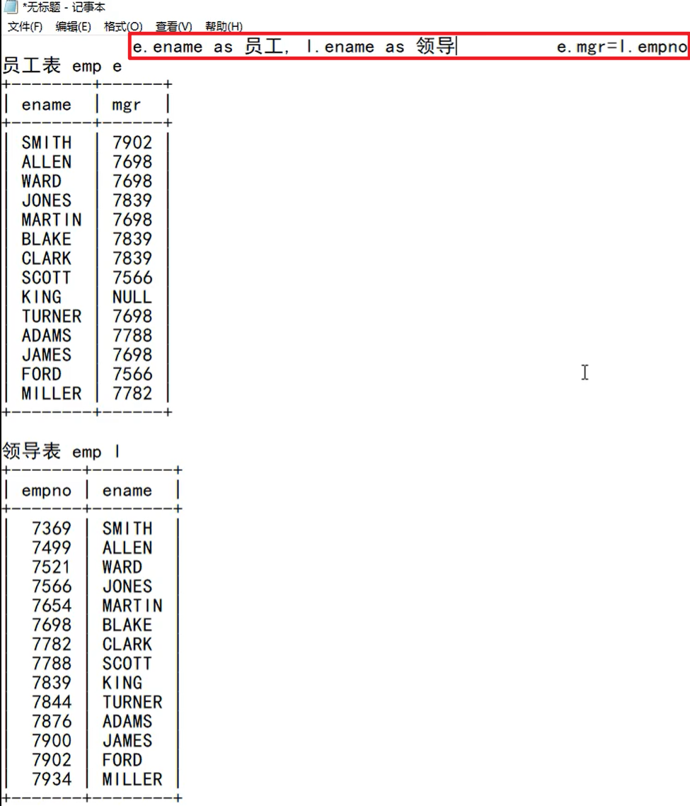
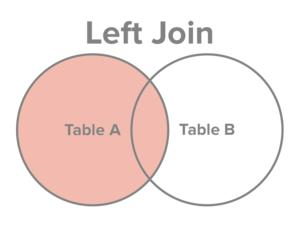
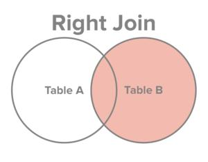

# MySQL | DQL语句-连接查询

## 什么是连接查询

1. 从一张表中查询数据称为单表查询。
2. 从两张或更多张表中联合查询数据称为`多表查询`，又叫做连接查询。
3. 什么时候需要使用连接查询？
   1. 比如这样的需求：`员工表中有员工姓名，部门表中有部门名字，要求查询每个员工所在的部门名字，这个时候就需要连接查询`。
## 连接查询的分类

1. 根据语法出现的年代进行分类：
   1. SQL92（这种语法很少用，可以不用学。）
   2. SQL99（我们主要学习这种语法。）
2. 根据连接方式的不同进行分类：
   1. 内连接
      1. 等值连接
      2. 非等值连接
      3. 自连接
   2. 外连接
      1. 左外连接（左连接）
      2. 右外连接（右连接）
   3. 全连接


## 笛卡尔积现象

> 1. 当两张表进行连接查询时，如果 **`没有任何条件进行过滤`**，最终的**`查询结果条数`**是**`两张表条数的乘积`**。为了避免笛卡尔积现象的发生，需要添加条件进行筛选过滤。
> 2. 需要注意：`添加条件`之后，虽然避免了笛卡尔积现象，但是`匹配的次数没有减少`。
> 3. 为了SQL语句的可读性，为了`执行效率`，建议`给表起别名`。

**例子**：

```sql
mysql> select * from emp;
+-------+--------+-----------+------+------------+---------+---------+--------+
| EMPNO | ENAME  | JOB       | MGR  | HIREDATE   | SAL     | COMM    | DEPTNO |
+-------+--------+-----------+------+------------+---------+---------+--------+
|  7369 | SMITH  | CLERK     | 7902 | 1980-12-17 |  800.00 |    NULL |     20 |
|  7499 | ALLEN  | SALESMAN  | 7698 | 1981-02-20 | 1600.00 |  300.00 |     30 |
|  7521 | WARD   | SALESMAN  | 7698 | 1981-02-22 | 1250.00 |  500.00 |     30 |
|  7566 | JONES  | MANAGER   | 7839 | 1981-04-02 | 2975.00 |    NULL |     20 |
|  7654 | MARTIN | SALESMAN  | 7698 | 1981-09-28 | 1250.00 | 1400.00 |     30 |
|  7698 | BLAKE  | MANAGER   | 7839 | 1981-05-01 | 2850.00 |    NULL |     30 |
|  7782 | CLARK  | MANAGER   | 7839 | 1981-06-09 | 2450.00 |    NULL |     10 |
|  7788 | SCOTT  | ANALYST   | 7566 | 1987-04-19 | 3000.00 |    NULL |     20 |
|  7839 | KING   | PRESIDENT | NULL | 1981-11-17 | 5000.00 |    NULL |     10 |
|  7844 | TURNER | SALESMAN  | 7698 | 1981-09-08 | 1500.00 |    0.00 |     30 |
|  7876 | ADAMS  | CLERK     | 7788 | 1987-05-23 | 1100.00 |    NULL |     20 |
|  7900 | JAMES  | CLERK     | 7698 | 1981-12-03 |  950.00 |    NULL |     30 |
|  7902 | FORD   | ANALYST   | 7566 | 1981-12-03 | 3000.00 |    NULL |     20 |
|  7934 | MILLER | CLERK     | 7782 | 1982-01-23 | 1300.00 |    NULL |     10 |
+-------+--------+-----------+------+------------+---------+---------+--------+
14 rows in set (0.00 sec)

mysql> select * from dept;
+--------+------------+----------+
| DEPTNO | DNAME      | LOC      |
+--------+------------+----------+
|     10 | ACCOUNTING | NEW YORK |
|     20 | RESEARCH   | DALLAS   |
|     30 | SALES      | CHICAGO  |
|     40 | OPERATIONS | BOSTON   |
+--------+------------+----------+
4 rows in set (0.03 sec)

mysql> select e.ename,d.dname from emp e,dept d;
+--------+------------+
| ename  | dname      |
+--------+------------+
| SMITH  | OPERATIONS |
| SMITH  | SALES      |
| SMITH  | RESEARCH   |
| SMITH  | ACCOUNTING |
| ALLEN  | OPERATIONS |
| ALLEN  | SALES      |
| ALLEN  | RESEARCH   |
| ALLEN  | ACCOUNTING |
| WARD   | OPERATIONS |
| WARD   | SALES      |
| WARD   | RESEARCH   |
| WARD   | ACCOUNTING |
| JONES  | OPERATIONS |
| JONES  | SALES      |
| JONES  | RESEARCH   |
| JONES  | ACCOUNTING |
| MARTIN | OPERATIONS |
| MARTIN | SALES      |
| MARTIN | RESEARCH   |
| MARTIN | ACCOUNTING |
| BLAKE  | OPERATIONS |
| BLAKE  | SALES      |
| BLAKE  | RESEARCH   |
| BLAKE  | ACCOUNTING |
| CLARK  | OPERATIONS |
| CLARK  | SALES      |
| CLARK  | RESEARCH   |
| CLARK  | ACCOUNTING |
| SCOTT  | OPERATIONS |
| SCOTT  | SALES      |
| SCOTT  | RESEARCH   |
| SCOTT  | ACCOUNTING |
| KING   | OPERATIONS |
| KING   | SALES      |
| KING   | RESEARCH   |
| KING   | ACCOUNTING |
| TURNER | OPERATIONS |
| TURNER | SALES      |
| TURNER | RESEARCH   |
| TURNER | ACCOUNTING |
| ADAMS  | OPERATIONS |
| ADAMS  | SALES      |
| ADAMS  | RESEARCH   |
| ADAMS  | ACCOUNTING |
| JAMES  | OPERATIONS |
| JAMES  | SALES      |
| JAMES  | RESEARCH   |
| JAMES  | ACCOUNTING |
| FORD   | OPERATIONS |
| FORD   | SALES      |
| FORD   | RESEARCH   |
| FORD   | ACCOUNTING |
| MILLER | OPERATIONS |
| MILLER | SALES      |
| MILLER | RESEARCH   |
| MILLER | ACCOUNTING |
+--------+------------+
56 rows in set (0.01 sec)
```
> 说明：
> 1. 笛卡尔积现象：查询结果为`14*4=56`条记录。
> 2. 给表起别名：`为了避免表名重复，给表起别名。`


## 内连接

### 什么叫内连接


> 内连接：查询的结果是两张表的交集。
> 满足条件的记录才会出现在结果集中。

### 内连接之等值连接

> 连接时，条件为等量关系。

> **案例：查询`每个员工所在的部门名称`，要求显示`员工名、部门名`**。

```sql
select
	e.ename,d.dname
from
	emp e
inner join
	dept d
on
	e.deptno = d.deptno;

SELECT e.ename, d.dname FROM emp e (inner) JOIN dept d ON e.deptno = d.deptno;
```

> **`员工表(emp)`**：
```sql 
mysql> select * from emp;
+-------+--------+-----------+------+------------+---------+---------+--------+
| EMPNO | ENAME  | JOB       | MGR  | HIREDATE   | SAL     | COMM    | DEPTNO |
+-------+--------+-----------+------+------------+---------+---------+--------+
|  7369 | SMITH  | CLERK     | 7902 | 1980-12-17 |  800.00 |    NULL |     20 |
|  7499 | ALLEN  | SALESMAN  | 7698 | 1981-02-20 | 1600.00 |  300.00 |     30 |
|  7521 | WARD   | SALESMAN  | 7698 | 1981-02-22 | 1250.00 |  500.00 |     30 |
|  7566 | JONES  | MANAGER   | 7839 | 1981-04-02 | 2975.00 |    NULL |     20 |
|  7654 | MARTIN | SALESMAN  | 7698 | 1981-09-28 | 1250.00 | 1400.00 |     30 |
|  7698 | BLAKE  | MANAGER   | 7839 | 1981-05-01 | 2850.00 |    NULL |     30 |
|  7782 | CLARK  | MANAGER   | 7839 | 1981-06-09 | 2450.00 |    NULL |     10 |
|  7788 | SCOTT  | ANALYST   | 7566 | 1987-04-19 | 3000.00 |    NULL |     20 |
|  7839 | KING   | PRESIDENT | NULL | 1981-11-17 | 5000.00 |    NULL |     10 |
|  7844 | TURNER | SALESMAN  | 7698 | 1981-09-08 | 1500.00 |    0.00 |     30 |
|  7876 | ADAMS  | CLERK     | 7788 | 1987-05-23 | 1100.00 |    NULL |     20 |
|  7900 | JAMES  | CLERK     | 7698 | 1981-12-03 |  950.00 |    NULL |     30 |
|  7902 | FORD   | ANALYST   | 7566 | 1981-12-03 | 3000.00 |    NULL |     20 |
|  7934 | MILLER | CLERK     | 7782 | 1982-01-23 | 1300.00 |    NULL |     10 |
+-------+--------+-----------+------+------------+---------+---------+--------+
14 rows in set (0.01 sec)
```

> **`部门表(dept)`**：
```sql
mysql> select * from dept;
+--------+------------+----------+
| DEPTNO | DNAME      | LOC      |
+--------+------------+----------+
|     10 | ACCOUNTING | NEW YORK |
|     20 | RESEARCH   | DALLAS   |
|     30 | SALES      | CHICAGO  |
|     40 | OPERATIONS | BOSTON   |
+--------+------------+----------+
4 rows in set (0.00 sec)
```

::: tip 提示
通过上述员工表和部门表可知，`每个员工所在的部门名称`是通过`deptno`字段进行连接的。
:::

> **`内连接之等值连接查询结果:`**
```sql
mysql> SELECT e.ename, d.dname FROM emp e JOIN dept d ON e.deptno = d.deptno;
+--------+------------+
| ename  | dname      |
+--------+------------+
| SMITH  | RESEARCH   |
| ALLEN  | SALES      |
| WARD   | SALES      |
| JONES  | RESEARCH   |
| MARTIN | SALES      |
| BLAKE  | SALES      |
| CLARK  | ACCOUNTING |
| SCOTT  | RESEARCH   |
| KING   | ACCOUNTING |
| TURNER | SALES      |
| ADAMS  | RESEARCH   |
| JAMES  | SALES      |
| FORD   | RESEARCH   |
| MILLER | ACCOUNTING |
+--------+------------+
14 rows in set (0.01 sec)
```

::: tip 提示
1. 底层也是进行56次匹配，但是由于`deptno`是主键，所以只匹配一次。

2. inner可以省略。
:::


### 内连接之非等值连接

连接时，条件是非等量关系。

> 案例：查询`每个员工的工资等级`，要求显示`员工名、工资、工资等级`。

```sql
select
	e.ename,e.sal,s.grade
from
	emp e
join
	salgrade s
on
	e.sal between s.losal and s.hisal;

SELECT e.ename, e.sal, s.grade FROM emp e INNER JOIN salgrade s ON e.sal BETWEEN s.losal AND s.hisal;
```

> **`员工表(emp)`**：
```sql
mysql> select * from emp;
+-------+--------+-----------+------+------------+---------+---------+--------+
| EMPNO | ENAME  | JOB       | MGR  | HIREDATE   | SAL     | COMM    | DEPTNO |
+-------+--------+-----------+------+------------+---------+---------+--------+
|  7369 | SMITH  | CLERK     | 7902 | 1980-12-17 |  800.00 |    NULL |     20 |
|  7499 | ALLEN  | SALESMAN  | 7698 | 1981-02-20 | 1600.00 |  300.00 |     30 |
|  7521 | WARD   | SALESMAN  | 7698 | 1981-02-22 | 1250.00 |  500.00 |     30 |
|  7566 | JONES  | MANAGER   | 7839 | 1981-04-02 | 2975.00 |    NULL |     20 |
|  7654 | MARTIN | SALESMAN  | 7698 | 1981-09-28 | 1250.00 | 1400.00 |     30 |
|  7698 | BLAKE  | MANAGER   | 7839 | 1981-05-01 | 2850.00 |    NULL |     30 |
|  7782 | CLARK  | MANAGER   | 7839 | 1981-06-09 | 2450.00 |    NULL |     10 |
|  7788 | SCOTT  | ANALYST   | 7566 | 1987-04-19 | 3000.00 |    NULL |     20 |
|  7839 | KING   | PRESIDENT | NULL | 1981-11-17 | 5000.00 |    NULL |     10 |
|  7844 | TURNER | SALESMAN  | 7698 | 1981-09-08 | 1500.00 |    0.00 |     30 |
|  7876 | ADAMS  | CLERK     | 7788 | 1987-05-23 | 1100.00 |    NULL |     20 |
|  7900 | JAMES  | CLERK     | 7698 | 1981-12-03 |  950.00 |    NULL |     30 |
|  7902 | FORD   | ANALYST   | 7566 | 1981-12-03 | 3000.00 |    NULL |     20 |
|  7934 | MILLER | CLERK     | 7782 | 1982-01-23 | 1300.00 |    NULL |     10 |
+-------+--------+-----------+------+------------+---------+---------+--------+
14 rows in set (0.00 sec)
```

> **`工资等级表(salgrade)`**：
```sql
mysql> select * from salgrade;
+-------+-------+-------+
| GRADE | LOSAL | HISAL |
+-------+-------+-------+
|     1 |   700 |  1200 |
|     2 |  1201 |  1400 |
|     3 |  1401 |  2000 |
|     4 |  2001 |  3000 |
|     5 |  3001 |  9999 |
+-------+-------+-------+
5 rows in set (0.00 sec)
```

::: tip 提示
通过上述员工表和工资等级表可知，`每个员工的工资等级`是通过`sal`字段进行连接的。

利用`between`关键字连接losal和hisal进行非等值连接。
:::


> **`内连接之非等值连接查询结果：`**
```sql 
mysql> SELECT e.ename, e.sal, s.grade FROM emp e INNER JOIN salgrade s ON e.sal BETWEEN s.losal AND s.hisal;
+--------+---------+-------+
| ename  | sal     | grade |
+--------+---------+-------+
| SMITH  |  800.00 |     1 |
| ALLEN  | 1600.00 |     3 |
| WARD   | 1250.00 |     2 |
| JONES  | 2975.00 |     4 |
| MARTIN | 1250.00 |     2 |
| BLAKE  | 2850.00 |     4 |
| CLARK  | 2450.00 |     4 |
| SCOTT  | 3000.00 |     4 |
| KING   | 5000.00 |     5 |
| TURNER | 1500.00 |     3 |
| ADAMS  | 1100.00 |     1 |
| JAMES  |  950.00 |     1 |
| FORD   | 3000.00 |     4 |
| MILLER | 1300.00 |     2 |
+--------+---------+-------+
14 rows in set (0.01 sec)
```


### 内连接之自连接

> 连接时，一张表看做两张表，`自己和自己进行连接`。

> 案例：找出`每个员工的直属领导`，要求显示`员工名、领导名`。
```sql
select
	e.ename 员工名, l.ename 领导名
from
	emp e
join
	emp l
on
	e.mgr = l.empno;
```

> **`内连接之自连接查询结果:`**
```sql
mysql> select e.ename 员工, l.ename 领导 from emp e join emp l on e.mgr = l.empno;
+--------+-------+
| 员工   | 领导  |
+--------+-------+
| SMITH  | FORD  |
| ALLEN  | BLAKE |
| WARD   | BLAKE |
| JONES  | KING  |
| MARTIN | BLAKE |
| BLAKE  | KING  |
| CLARK  | KING  |
| SCOTT  | JONES |
| TURNER | BLAKE |
| ADAMS  | SCOTT |
| JAMES  | BLAKE |
| FORD   | JONES |
| MILLER | CLARK |
+--------+-------+
13 rows in set (0.01 sec)
```

::: 提示



可以发现连接条件是：**`e.mgr = l.empno（员工的领导编号=领导的员工编号）`**

**注意：`KING这个员工没有查询出来`。如果想将`KING也查询出来，需要使用外连接`。**
:::


## 外连接

### 什么叫外连接

> **`内连接`是`满足条件的记录查询出来`。也就是`两张表的交集`**。

> **`外连接`是`除了满足条件的记录查询出来`，再将`其中一张表的记录全部查询出来`，另一张表`如果没有与之匹配的记录`，`自动模拟出NULL与其匹配`。**

左外连接：



右外连接：



### 外连接之左外连接（左连接）

案例：查询所有部门信息，并且找出每个部门下的员工。
```sql
select
  d.*,e.ename
from
  dept d
left outer join
  emp e
on
  d.deptno = e.deptno;
```

注意：outer可以省略。
任何一个左连接都可以写作右连接。

### 外连接之右外连接（右连接）
还是上面的案例，可以写作右连接。
```sql
select
  d.*,e.ename
from
  emp e
right outer join
  dept d
on
  d.deptno = e.deptno;
```

案例：找出所有员工的上级领导，要求显示员工名和领导名。
```sql
select 
  e.ename 员工名,l.ename 领导名 
from 
  emp e 
left join 
  emp l 
on
  e.mgr = l.empno;
```
```sql
select 
  e.ename 员工名,l.ename 领导名 
from 
  emp l 
right join 
  emp e 
on
  e.mgr = l.empno;
```


## 全连接
什么是全连接？
MySQL不支持full join。oracle数据库支持。

两张表数据全部查询出来，没有匹配的记录，各自为对方模拟出NULL进行匹配。
客户表：t_customer

订单表：t_order

案例：查询所有的客户和订单。
```sql
select 
 c.*,o.* 
from 
 t_customer c 
full join 
 t_order o 
on 
 c.cid = o.cid;
```

## 多张表连接
三张表甚至更多张表如何进行表连接
案例：找出每个员工的部门，并且要求显示每个员工的薪资等级。
```sql
select 
 e.ename,d.dname,s.grade 
from 
 emp e 
join 
 dept d 
on 
 e.deptno = d.deptno 
join 
 salgrade s 
on 
 e.sal between s.losal and s.hisal;
```


# 子查询

## 什么是子查询

1. select语句中嵌套select语句就叫做子查询。
2. select语句可以嵌套在哪里？
   1. where后面、from后面、select后面都是可以的。

```sql
select ..(select)..
from ..(select)..
where ..(select)..
```


## where后面使用子查询
案例：找出高于平均薪资的员工姓名和薪资。
错误的示范：
```sql
select ename,sal from emp where sal > avg(sal);
```
错误原因：where后面不能直接使用分组函数。
可以使用子查询：
```sql
select ename,sal from emp where sal > (select avg(sal) from emp);
```

## from后面使用子查询
小窍门：from后面的子查询可以看做一张临时表。
案例：找出每个部门的平均工资的等级。
第一步：先找出每个部门平均工资。
```sql
select deptno, avg(sal) avgsal from emp group by deptno;
```

第二步：将以上查询结果当做临时表t，t表和salgrade表进行连接查询。条件：t.avgsal between s.losal and s.hisal
```sql
select t.*,s.grade from (select deptno, avg(sal) avgsal from emp group by deptno) t join salgrade s on t.avgsal between s.losal and s.hisal;
```


## select后面使用子查询
```sql
select e.ename,(select d.dname from dept d where e.deptno = d.deptno) as dname from emp e;
```

## exists、not exists
在 MySQL 数据库中，EXISTS（存在）用于检查子查询的查询结果行数是否大于0。如果子查询的查询结果行数大于0，则 EXISTS 条件为真。（即存在查询结果则是true。）

主要应用场景：

- EXISTS 可以与 SELECT、UPDATE、DELETE 一起使用，用于检查另一个查询是否返回任何行；
- EXISTS 可以用于验证条件子句中的表达式是否存在；
- EXISTS 常用于子查询条件过滤，例如查询有订单的用户等。

```sql
drop table if exists t_customer;
drop table if exists t_order;

create table t_customer(
  customer_id int,
  customer_name varchar(32)
);

create table t_order(
  order_id int,
  order_price decimal(5,1),
  customer_id int
);

insert into t_customer(customer_id,customer_name) values(1,'zhangsan');
insert into t_customer(customer_id,customer_name) values(2,'lisi');
insert into t_customer(customer_id,customer_name) values(3,'wangwu');

insert into t_order(order_id, order_price, customer_id) values(10, 1000.0, 1);
insert into t_order(order_id, order_price, customer_id) values(20, 2000.0, 1);
insert into t_order(order_id, order_price, customer_id) values(30, 3000.0, 2);
insert into t_order(order_id, order_price, customer_id) values(40, 4000.0, 2);

commit;
select * from t_customer;
select * from t_order;
```
现在我们来看一个简单的案例，假设我们要查询先前有过订单的顾客，而订单信息保存在 t_order 表中，顾客信息保存在 t_customer 表中。我们可以使用以下 sql 语句：

```sql
select * from t_customer c where exists(select * from t_order o where o.customer_id=c.customer_id);
```

在这个查询语句中，子查询用于检查是否有订单与每个客户相关联。如果子查询返回至少一行，则表示该顾客已经下过订单，并返回此客户的所有信息，否则该顾客将不被包含在结果中。

以下是这个查询语句的执行过程：

1.  首先查询表 t_customer 中的所有顾客信息（以下简称为顾客表）； 
2.  对于顾客表中的每一行，都执行一次子查询，子查询查询该顾客有没有订单，如果有，则在结果集中保留该顾客信息；如果没有，则将该顾客排除； 
3.  最终返回有订单顾客的所有信息。 

除了 EXISTS，也可以使用 NOT EXISTS 条件从 SELECT、UPDATE、DELETE 语句中获取子查询的返回结果。NOT EXISTS 用于检查一个子查询是否返回任何行，如果没有行返回，那么 NOT EXISTS 将返回 true。

例如，我们想要查找所有没有下过订单的顾客，可以使用以下 sql 语句：

```sql
select * from t_customer c where not exists(select * from t_order o where o.customer_id=c.customer_id);
```

在这个查询语句中，如果没有任何与顾客相关联的订单，则 NOT EXISTS 子查询将返回一个空结果集，这时候 WHERE 条件为 true，并将返回所有顾客信息。如果顾客有订单，则 NOT EXISTS 子查询的结果集将不为空，WHERE 条件为 false，则不会返回该顾客的信息。

总之，无论是 EXISTS 还是 NOT EXISTS，都是非常有用的 SQL 工具。可以通过它们来结合子查询来动态过滤查询结果，使 SQL 查询变得更加灵活和高效。

## in和exists区别
IN 和 EXISTS 都是用于关系型数据库查询的操作符。不同之处在于：

1.  IN 操作符是根据指定列表中的值来判断是否满足条件，而 EXISTS 操作符则是根据子查询的结果是否有返回记录集来判断。 
2.  EXISTS 操作符通常比 IN 操作符更快，尤其是在子查询返回记录数很大的情况下。因为 EXISTS 只需要判断是否存在符合条件的记录，而 IN 操作符需要比对整个列表，因此执行效率相对较低。 
3.  IN 操作符可同时匹配多个值，而 EXISTS 只能匹配一组条件。 

下面是一个简单的示例，用于演示 IN 和 EXISTS 之间的区别。假设我们有两个表 orders 和 products，orders 表中记录了订单信息，products 表中记录了商品信息。现在我们想查询所有“手机”和“平板电脑”这两种商品中，至少有一笔订单销售了 $1000 以上的商品：

使用 IN 操作符：

```sql
SELECT *
FROM products
WHERE product_name IN ('手机', '平板电脑')
AND product_id IN (
  SELECT product_id
  FROM orders
  WHERE order_amount > 1000
);
```

使用 EXISTS 操作符：

```sql
SELECT *
FROM products
WHERE product_name IN ('手机', '平板电脑')
AND EXISTS (
  SELECT *
  FROM orders
  WHERE orders.product_id = products.product_id
  AND order_amount > 1000
);
```

总之，IN 和 EXISTS 都是用于条件过滤的操作符，但其实现方式和性能特点都不同，需要根据具体情况进行选择和使用。
# union&union all
不管是union还是union all都可以将两个查询结果集进行合并。
union会对合并之后的查询结果集进行去重操作。
union all是直接将查询结果集合并，不进行去重操作。（union all和union都可以完成的话，优先选择union all，union all因为不需要去重，所以效率高一些。）


案例：查询工作岗位是MANAGER和SALESMAN的员工。
```sql
select ename,sal from emp where job='MANAGER'
union all
select ename,sal from emp where job='SALESMAN';
```
以上案例采用or也可以完成，那or和union all有什么区别？考虑走索引优化之类的选择union all，其它选择or。
两个结果集合并时，列数量要相同：


# limit

1. limit作用：查询第几条到第几条的记录。通常是因为表中数据量太大，需要分页显示。
2. limit语法格式：
   1. limit 开始下标, 长度
3. 案例：查询员工表前5条记录
```sql
select ename,sal from emp limit 0, 5;
```
如果下标是从0开始，可以简写为：
```sql
select ename,sal from emp limit 5;
```

4. 查询工资排名在前5名的员工（limit是在order by执行之后才会执行的）
```sql
select ename,sal from emp order by sal desc limit 5;
```

5. 通用的分页sql

假设每页显示3条记录：pageSize = 3
第1页：limit 0, 3
第2页：limit 3, 3
第3页：limit 6, 3
第pageNo页：limit (pageNo - 1)*pageSize, pageSize
