# MySQL | Navicat安装教程

## 简介

`Navicat` 是一款流行的 `图形化数据库管理工具`，由 PremiumSoft 公司开发，支持多种主流数据库系统（如 `MySQL、MariaDB、SQL Server、Oracle、PostgreSQL、SQLite `等），提供直观的界面和丰富的功能，帮助用户高效管理、开发和维护数据库。

## 下载Navicat

::: tip 提示
官网下载: [Navicat](https://www.navicat.com.cn/download/navicat-premium)
:::

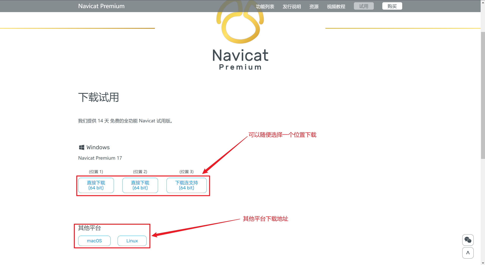

## 安装Navicat

### 双击安装包运行

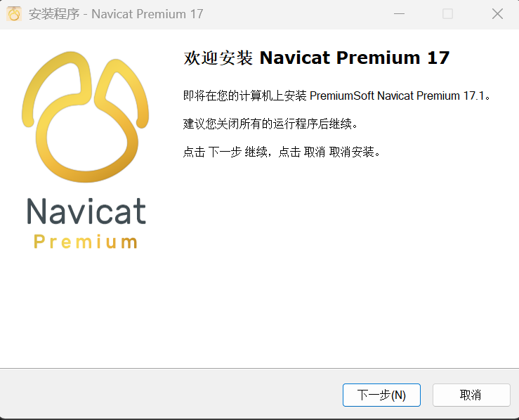

### 同意协议

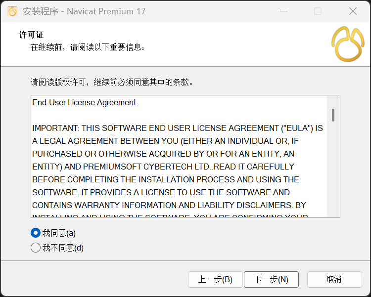

### 选择安装路径

::: tip 提示
我建议安装在D盘下，可以减少C盘空间占用，还有安装路径不要有中文，否则会出现一些问题。
:::

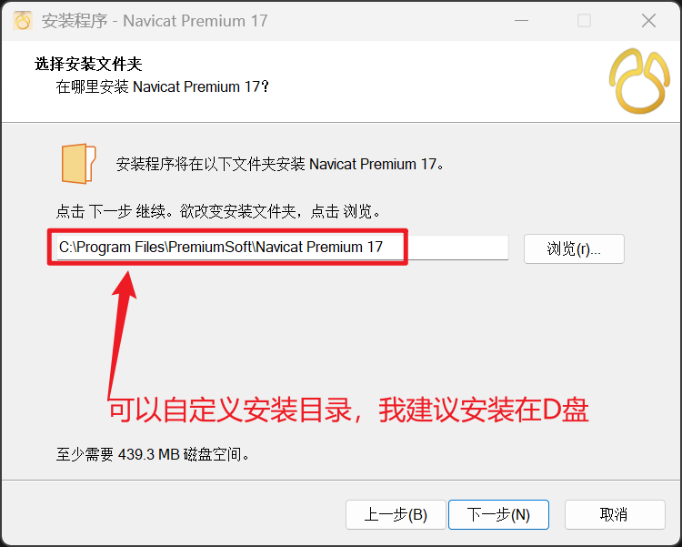

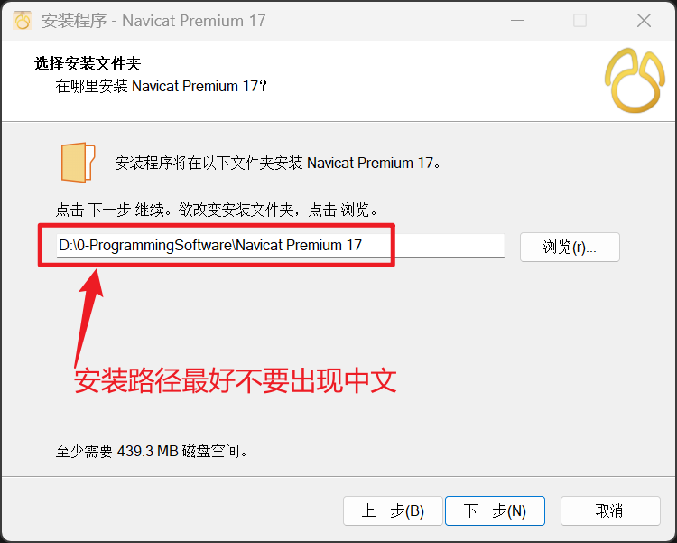

### 创建桌面快捷方式

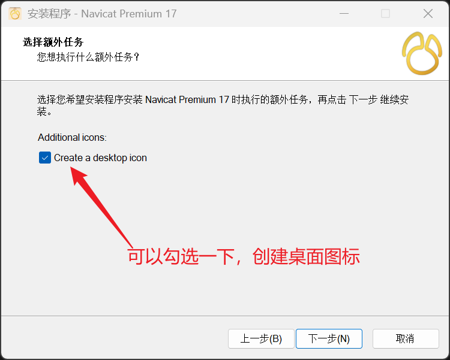

### 安装完成

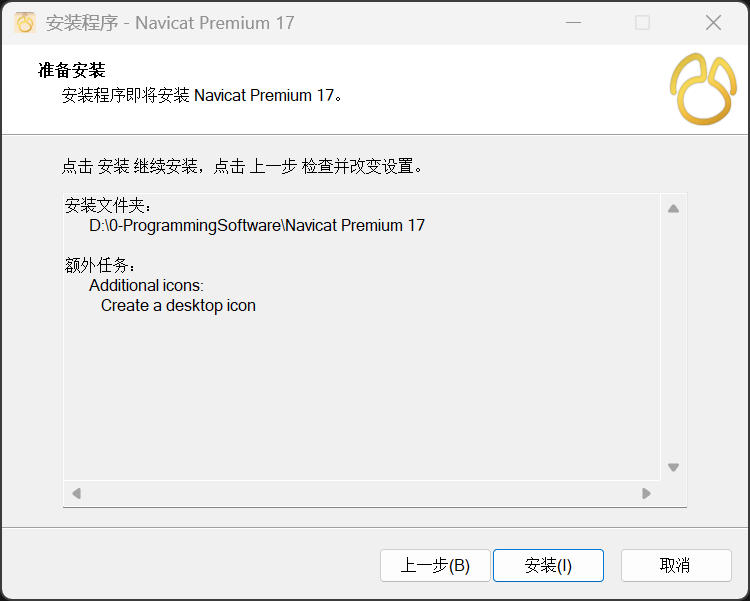

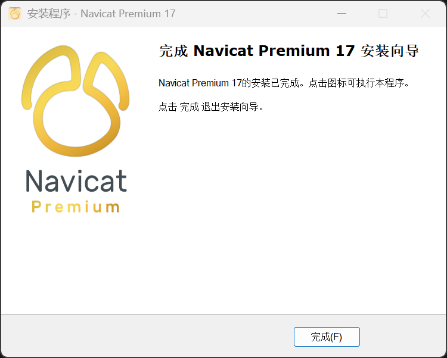

## 连接本地数据库

### 打开Navicat

### 点击左上角的`+`号，选择`MySQL`

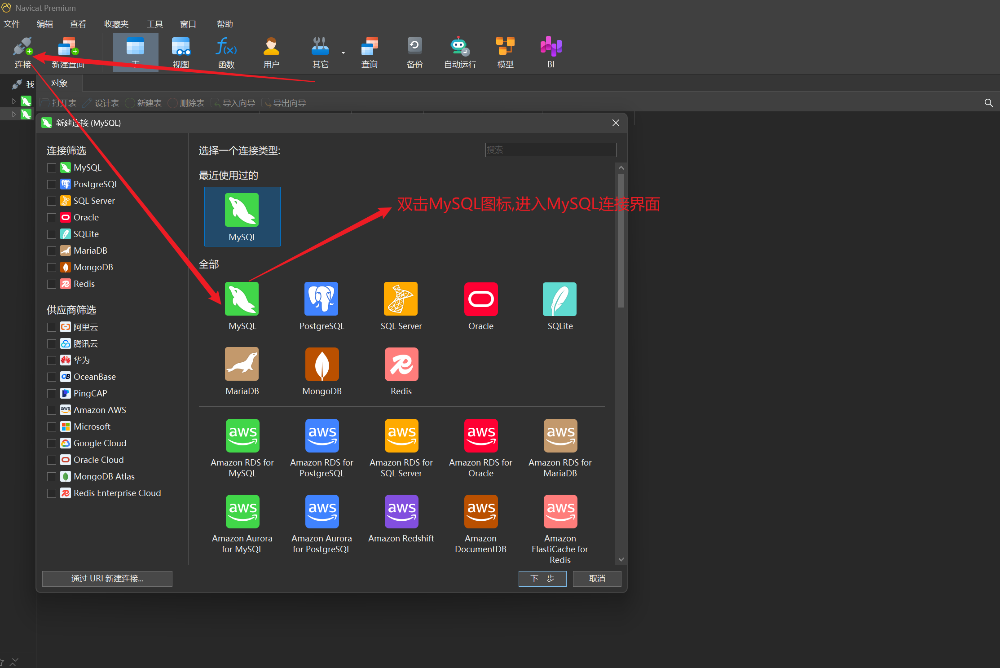

### 输入连接信息

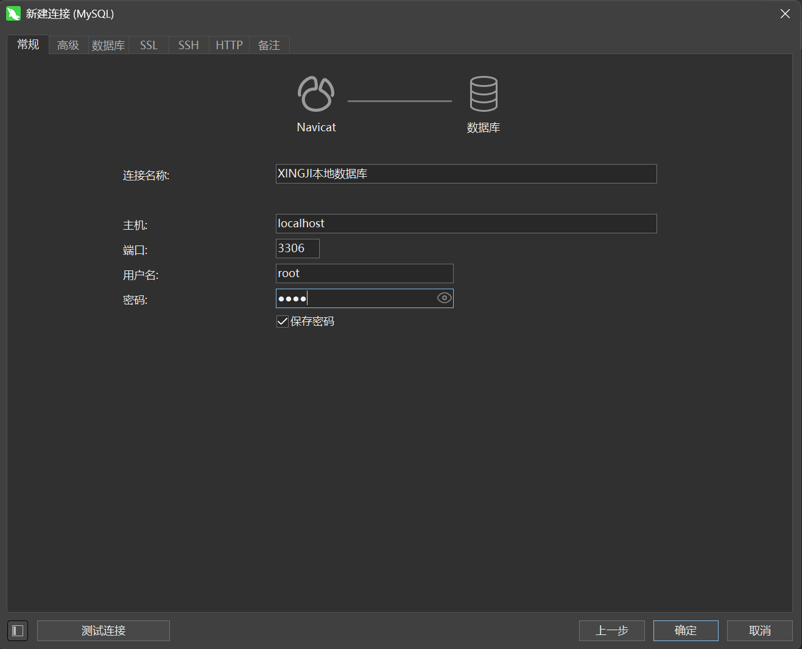

### 连接成功

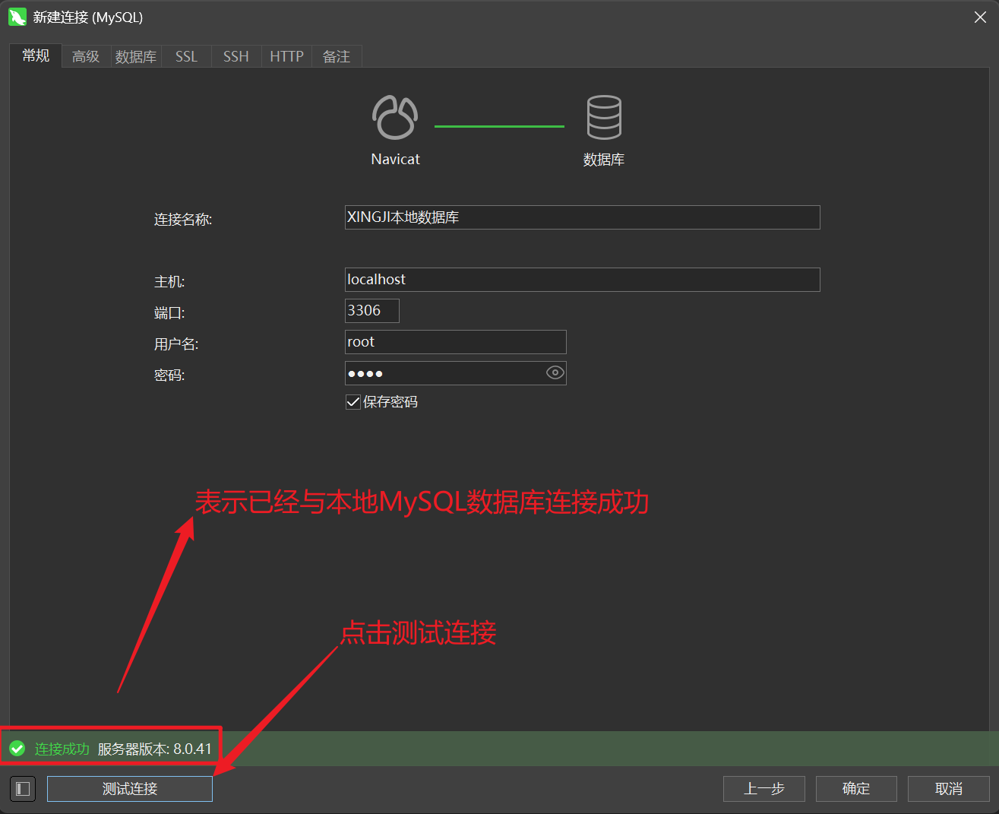

::: tip 提示
这是一个收费软件，需要注册，注册码可以在网上搜索。可以看看这篇CSDN的文章[Navicat破解](https://blog.csdn.net/qq_36324341/article/details/140777029)
:::