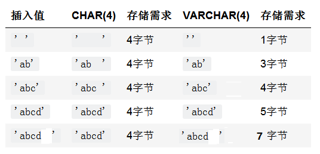
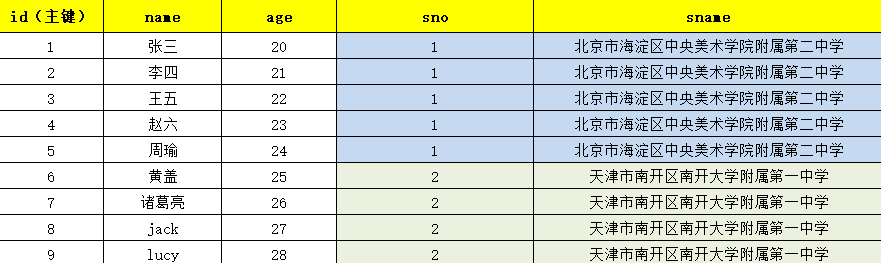
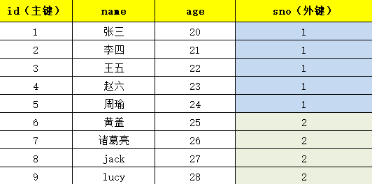

# MySQL | 表相关操作


---

## 创建表

语法格式：
```sql
create table 表名(
  字段名1 数据类型,
  字段名2 数据类型,
  字段名3 数据类型,
  ......
);
```
> **例如：`创建用户表`**

```sql
create table t_user(
  no int,
  name varchar(20),
  gender char(1) default '男'
);

mysql> desc t_user;
+--------+-------------+------+-----+---------+-------+
| Field  | Type        | Null | Key | Default | Extra |
+--------+-------------+------+-----+---------+-------+
| no     | int         | YES  |     | NULL    |       |
| name   | varchar(20) | YES  |     | NULL    |       |
| gender | char(1)     | YES  |     | 男      |       |
+--------+-------------+------+-----+---------+-------+
3 rows in set (0.01 sec)
```


## 插入数据

**`语法格式`：**

```sql
insert into 表名(字段名1, 字段名2, 字段名3,......) values (值1,值2,值3,......);
```

```sql
mysql> insert into t_user(no,name,gender) values(1,'jack','男');
Query OK, 1 row affected (0.01 sec)
mysql> insert into t_user(no,name,gender) values(2,'lucy','女');
Query OK, 1 row affected (0.01 sec)

mysql> select * from t_user;
+------+------+--------+
| no   | name | gender |
+------+------+--------+
|    1 | jack | 男     |
|    2 | lucy | 女     |
+------+------+--------+
2 rows in set (0.00 sec)
```
::: tip 提示
**`字段名和值要一一对应`。`类型要一一对应`，`数量要一一对应`。**

字段名也可以省略，如果字段名省略就表示`把所有字段名都写上去了`，并且`顺序和建表时的顺序相同`。
:::

## 删除表

语法格式：
```sql
drop table 表名;
```
或者
```sql
drop table if exists 表名;
```
> **判断`是否存在这个表`，如果`存在则删除`。避免`不存在时的报错`。**


## MySQL数据类型

::: tip 提示
数据类型（data_type）是指系统中所允许的数据的类型。数据库中的每个列都应该有适当的数据类型，用于限制或允许该列中存储的数据。例如，列中存储的为数字，则相应的数据类型应该为数值类型。
如果使用错误的数据类型可能会严重影响应用程序的功能和性能，所以在设计表时，应该特别重视数据列所用的数据类型。更改包含数据的列不是一件小事，这样做可能会导致数据丢失。因此，在创建表时必须为每个列设置正确的数据类型和长度。

> **MySQL 的数据类型可以分为`整数类型、浮点数类型、定点数类型、日期和时间类型、字符串类型、二进制类型`等。**
:::

### 整数类型

tinyint：1个字节（微小整数）
smallint：2个字节（小整数）
mediumint：3个字节（中等大小的整数）
> **`int（integer）：4个字节（普通大小整数）`**
> **`bigint：8个字节（大整数）`**

### 浮点数类型

float：4个字节，单精度（最多5位小数）
> **`double：8个字节，双精度（最多16位小数）`**

### 定点数类型

> **`decimal`：`定点数类型`。底层实际上采用`字符串的形式存储数字`。**

```sql
语法：decimal(m, d)

m：表示总位数，m的范围是 1～65。
d：表示小数位数，d的范围是 0～30，并且 d 不能大于 m。
```
::: tip 提示
例如：`decimal(3, 2)` 表示`3个有效数字`，`2个小数`。（`有效数字最多65个`，`小数位最多30个`）
:::

### 日期和时间类型

1. year：1个字节，`只存储年`，格式YYYY

2. time：3个字节，`只存储时间`，格式HH:MM:SS / HHMMSS

3. date：3个字节，`只存储年月日`，格式：YYYY-MM-DD

4. datetime：8个字节，`存储年月日+时分秒`，格式：YYYY-MM-DD HH:MM:SS（从公元1000年~公元9999年）

5. timestamp：4个字节，`存储年月日+时分秒`，格式：YYYY-MM-DD HH:MM:SS（从公元1980年~公元2040年）或者格式为 YYYYMMDDHHMMSS **（采用这种格式`不需要使用单引号`，当然你使用`单引号`也可以）**


### 字符串类型

#### char

**`char(m)`：**m长度是`0~255个字符`。

**`固定长度字符串`，在定义时`指定字符串列长`。当保存时，在右侧填充空格以达到指定的长度。`m表示列的长度`，范围是 `0～255 个字符`。**

> **例如，CHAR(4) 定义了一个固定长度的字符串列，包含的字符个数最大为 4。当插入的字符长度大于4，则报错（除非超过4个长度之后都是空格字符，则空格字符会自动被删除用来保证插入的成功）。**

#### varchar

**`varchar(m)`：**m长度是`0~16383个字符`

**`长度可变的字符串`。varchar 的`最大实际长度由最长的行的大小和使用的字符集`确定，而实际`占用的空间为字符串的实际长度加 1`。**

> **例如，varchar(50) 定义了一个最大长度为 50 的字符串，如果插入的字符串只有 10 个字符，则实际存储的字符串为 `10 个字符和一个字符串结束字符`。varchar在值保存和检索时尾部的空格仍保留。**

> **`char和varchar的比较`：**



#### text

**text类型：**

- `tinytext` 表示长度为 `255字符`的 TEXT 列。
- `text` 表示长度为 `65535字符`的 TEXT 列。
- `mediumtext` 表示长度为 `16777215字符`的 TEXT 列。
- `longtext `表示长度为 `4294967295` 或 `4GB 字符`的 TEXT 列。

#### enum

**enum类型：**

- 语法：<字段名> enum('值1','值2',...)
- **该字段插入值时，`只能是指定的枚举值`。**

#### set

**set类型：**

- 语法：<字段名> set('值1','值2','值3',...)`注意：值不可重复。`
- 该字段插入值时，只能是指定的值。

### 二进制类型

BLOB类型：`二进制大对象`，可以`存储图片、声音、视频等文件`。

- blob：小的，`最大长度65535个字节`
- mediumblob：中等的，`最大长度16777215个字节`
- longblob：大的，`最大长度4GB的字节`

## 增删改表结构DDL

### 创建一个用户表
```sql
create table t_user(
  no bigint,
  name varchar(32),
  age int comment '年龄'
);
```

### 查看建表语句
```sql
show create table 表名;

mysql> show create table t_user;
+--------+------------------------------------------------------------+
| Table  | Create Table|
+--------+------------------------------------------------------------+
| t_user | CREATE TABLE `t_user` (
  `no` bigint DEFAULT NULL,
  `name` varchar(32) DEFAULT NULL,
  `age` int DEFAULT NULL COMMENT '年龄'
) ENGINE=InnoDB DEFAULT CHARSET=utf8mb4 COLLATE=utf8mb4_0900_ai_ci |
+--------+-------------------------------------------------------------+
```

### 修改表名
```sql
alter table 表名 rename 新表名;
```

### 新增字段
```sql
alter table 表名 add 字段名 数据类型;
```

### 修改字段名
```sql
alter table 表名 change 旧字段名 新字段名 数据类型;
```

### 修改字段数据类型
```sql
alter table 表名 modify column 字段名 数据类型;
```

### 删除字段
```sql
alter table 表名 drop 字段名;
```


## DML语句

> **当我们对表中的数据进行`增删改`的时候，称它为`DML语句`。（数据操纵语言），主要包括：`insert、delete、update`**

### insert 增

**语法格式：**
```sql
insert into 表名(字段名1,字段名2,字段名3,...) values(值1,值2,值3,...);
```
> **表名后面的小括号当中的字段名如果省略掉，表示自动将所有字段都列出来了，并且字段的顺序和建表时的顺序一致。**

一般为了可读性强，建议把字段名写上。
```sql
insert into 表名 values(值1,值2,值3,...);
```
一次可以插入多条记录：
```sql
insert into t_stu(no,name,age) values(1,'jack',20),(2,'lucy',30);
```

### delete 删

**语法格式：**
```sql
# 将所有记录全部删除
delete from 表名;

# 删除符合条件的记录
delete from 表名 where 条件;
```
> **以上的删除属于`DML的方式删除`，这种删除的数据是`可以通过事务回滚`的方式`重新恢复`的，但是`删除的效率较低`。（这种删除是`支持事务`的。）**

> **另外还有一种删除表中数据的方式，但是这种方式`不支持事务`，不可以回滚，`删了之后`数据是`永远也找不回来了`。这种删除叫做：`表被截断`。**

> **注意：这个语句删除效率非常高，巨大的表，瞬间干掉所有数据。但不可恢复。**
```sql
# 这种删除不支持事务，不可以回滚
truncate table 表名;
```

### update 改
语法格式：
```sql
update 表名 set 字段名1=值1, 字段名2=值2, 字段名3=值3 where 条件;
```
如果没有更新条件的话，所有记录全部更新。


## 约束constraint

::: tip 提示
创建表时，可以给表的`字段添加约束`，可以`保证数据的完整性、有效性`。**比如大家`上网注册用户`时**常见的：**`用户名不能为空。对不起，用户名已存在`**。等提示信息。
:::

约束通常包括：

- 非空约束：`not null`
- 检查约束：`check`
- 唯一性约束：`unique`
- 主键约束：`primary key`
- 外键约束：`foreign key`

### 非空约束

**语法格式：**
```sql
create table t_stu(
  no int,
  name varchar(32) not null, # 提示：name字段不能为空
  age int
);
```

```sql
mysql> insert into t_stu(no,name,age) values(1,'zhangsan',20);
Query OK, 1 row affected (0.01 sec)

mysql> select * from t_stu;
+------+----------+------+
| no   | name     | age  |
+------+----------+------+
|    1 | zhangsan |   20 |
+------+----------+------+
1 row in set (0.00 sec)

mysql> insert into t_stu(no,age) values(1,20);

ERROR 1364 (HY000): Field 'name' doesn't have a default value
```
name字段不能为空。插入数据时如果没有给name指定值，则报错。


### 检查约束

```sql
create table t_stu(
  no int,
  name varchar(32),
  age int,
  check(age > 18)
);
```
```sql
mysql> insert into t_stu(no,name,age) values(1,'jack',20);
Query OK, 1 row affected (0.01 sec)

mysql> insert into t_stu(no,name,age) values(2,'tom',18);
ERROR 3819 (HY000): Check constraint 't_stu_chk_1' is violated. # 检查约束，age必须大于18

mysql> select * from t_stu;
+------+------+------+
| no   | name | age  |
+------+------+------+
|    1 | jack |   20 |
+------+------+------+
1 row in set (0.00 sec)

mysql> insert into t_stu(no,name,age) values(2,'tom',19);
Query OK, 1 row affected (0.01 sec)

mysql> select * from t_stu;
+------+------+------+
| no   | name | age  |
+------+------+------+
|    1 | jack |   20 |
|    2 | tom  |   19 |
+------+------+------+
2 rows in set (0.00 sec)
```


### 唯一性约束

> **`列级约束`：**

**语法格式：**
```sql
create table t_user(
  id int,
  name varchar(32),
  email varchar(255) unique # 唯一性约束
);
```

```sql
mysql> insert into t_user(id,name,email) values(1,'jack','jack@123.com');
Query OK, 1 row affected (0.01 sec)

mysql> insert into t_user(id,name,email) values(2,'lucy','lucy@123.com');
Query OK, 1 row affected (0.01 sec)

mysql> insert into t_user(id,name,email) values(3,'tom','lucy@123.com');
ERROR 1062 (23000): Duplicate entry 'lucy@123.com' for key 't_user.email' # 唯一性约束，email字段的值不能重复

mysql> select * from t_user;
+------+------+--------------+
| id   | name | email        |
+------+------+--------------+
|    1 | jack | jack@123.com |
|    2 | lucy | lucy@123.com |
+------+------+--------------+
2 rows in set (0.00 sec)

mysql> insert into t_user(id,name,email) values(2,'lucy','lucy@124.com');
Query OK, 1 row affected (0.01 sec)

mysql> select * from t_user;
+------+------+--------------+
| id   | name | email        |
+------+------+--------------+
|    1 | jack | jack@123.com |
|    2 | lucy | lucy@123.com |
|    2 | lucy | lucy@124.com |
+------+------+--------------+
3 rows in set (0.00 sec)
```
> **email字段设置为唯一性，`唯一性的字段值`是可以为`NULL`的。但不能重复。以上在`字段后面添加的约束`，叫做`列级约束`。**

> **当然，添加约束还有另一种方式：`表级约束`：**

```sql
create table t_stu(
  id int,
  name varchar(32),
  unique(name)
);
```
```sql
mysql> create table t_user(
    ->   id int,
    ->   name varchar(32),
    ->   unique(name)
    -> );
Query OK, 0 rows affected (0.07 sec)

mysql> insert into t_user(name) values('jack');
Query OK, 1 row affected (0.01 sec)

mysql> select * from t_user;
+------+------+
| id   | name |
+------+------+
| NULL | jack |
+------+------+
1 row in set (0.00 sec)

mysql> insert into t_user(name) values('jack');
ERROR 1062 (23000): Duplicate entry 'jack' for key 't_user.name' # 唯一性约束，name字段的值不能重复
```

使用表级约束可以为多个字段添加联合唯一。
```sql
create table t_user(
  id int,
  name varchar(32),
  email varchar(255),
  unique(name,email)
);
```

```sql
mysql> create table t_user(
    ->   id int,
    ->   name varchar(32),
    ->   email varchar(255),
    ->   unique(name,email)
    -> );
Query OK, 0 rows affected (0.04 sec)

mysql> insert into t_user(id,name,email) values(1,'jack','abc@123.com');
Query OK, 1 row affected (0.01 sec)

mysql> insert into t_user(id,name,email) values(2,'jack','xyz@123.com');
Query OK, 1 row affected (0.01 sec)

mysql> select * from t
    -> ^C
mysql> select * from t_user;
+------+------+-------------+
| id   | name | email       |
+------+------+-------------+
|    1 | jack | abc@123.com |
|    2 | jack | xyz@123.com |
+------+------+-------------+
2 rows in set (0.00 sec)

mysql> insert into t_user(id,name,email) values(3,'jack','xyz@123.com');
ERROR 1062 (23000): Duplicate entry 'jack-xyz@123.com' for key 't_user.name' # 唯一性约束，name和email字段的值不能重复(name和email联合唯一)
```

> **创建约束时也`可以给约束起名字`，将来可以通过`约束的名字`来`删除约束`：**

```sql
create table t_user(
  id int,
  name varchar(32),
  email varchar(255),
  constraint t_stu_name_email_unique unique(name,email)
);
```
```sql
mysql> create table t_user(
    ->   id int,
    ->   name varchar(32),
    ->   email varchar(255),
    ->   constraint t_stu_name_email_unique unique(name,email) # 给约束起名字
    -> );
Query OK, 0 rows affected (0.04 sec)

mysql> show databases;
+--------------------+
| Database           |
+--------------------+
| information_schema |
| mysql              |
| performance_schema |
| powernode          |
| studentsdb         |
| sys                |
+--------------------+
6 rows in set (0.00 sec)

mysql> use information_schema;
Database changed

mysql> show tables like '%constraint%';
+---------------------------------------------+
| Tables_in_information_schema (%CONSTRAINT%) |
+---------------------------------------------+
| CHECK_CONSTRAINTS                           |
| REFERENTIAL_CONSTRAINTS                     |
| TABLE_CONSTRAINTS                           |
| TABLE_CONSTRAINTS_EXTENSIONS                |
+---------------------------------------------+
4 rows in set (0.01 sec)

mysql> desc table_constraints;
+--------------------+-------------+------+-----+---------+-------+
| Field              | Type        | Null | Key | Default | Extra |
+--------------------+-------------+------+-----+---------+-------+
| CONSTRAINT_CATALOG | varchar(64) | YES  |     | NULL    |       |
| CONSTRAINT_SCHEMA  | varchar(64) | YES  |     | NULL    |       |
| CONSTRAINT_NAME    | varchar(64) | YES  |     | NULL    |       |
| TABLE_SCHEMA       | varchar(64) | YES  |     | NULL    |       |
| TABLE_NAME         | varchar(64) | YES  |     | NULL    |       |
| CONSTRAINT_TYPE    | varchar(11) | NO   |     |         |       |
| ENFORCED           | varchar(3)  | NO   |     |         |       |
+--------------------+-------------+------+-----+---------+-------+
7 rows in set (0.00 sec)

mysql> select constraint_name from table_constraints where table_name='t_user'; # 通过约束的名字来删除约束
+-------------------------+
| CONSTRAINT_NAME         |
+-------------------------+
| t_stu_name_email_unique |
+-------------------------+
1 row in set (0.01 sec)
```

```sql
mysql> create table t_user(
    ->   id int,
    ->   name varchar(32),
    ->   email varchar(255),
    ->   unique(name,email) # 给约束起名字
    -> );
Query OK, 0 rows affected (0.04 sec)

mysql> show databases;
+--------------------+
| Database           |
+--------------------+
| information_schema |
| mysql              |
| performance_schema |
| powernode          |
| studentsdb         |
| sys                |
+--------------------+
6 rows in set (0.00 sec)

mysql> use information_schema;
Database changed

mysql> select constraint_name from table_constraints where table_name='t_user'; # 通过约束的名字来删除约束
+-----------------+
| CONSTRAINT_NAME |
+-----------------+
| name            |
+-----------------+
1 row in set (0.00 sec)
```
> **所有的约束都存储在一个`系统表`当中：`table_constraints`。这个系统表在这个`数据库当`中：`information_schema`**


### 主键约束

::: tip 提示
1. 主键：`primary key`，简称`PK`

2. **`主键约束`的`字段不能为NULL`，并且`不能重复`。**

3. **`任何一张表都应该有主键`**，`没有主键的表`可以视为`无效表`。

4. **`主键值`是`这行记录的身份证号`，是`唯一标识`。在数据库表中即使`两条数据一模一样`，但由于`主键值不同`，我们也会认为是`两条完全的不同的数据`。**

5. **`主键分类`：**
   1. **根据`字段数量`分类：**
      1. `单一主键`**（1个字段作为主键）==>建议的**
      2. `复合主键`（2个或2个以上的字段作为主键）
   2. **根据`业务`分类：**
      1. `自然主键`**（主键和任何业务都无关，只是一个单纯的自然数据）===>建议的**
      2. `业务主键`（主键和业务挂钩，例如：`银行卡账号作为主键`）

6. **`单一主键`（`建议使用这种方式`）**
:::

```sql
create table t_user(
  id int primary key,
  name varchar(32)
);
```
```sql
mysql> create table t_user(
    ->   id int primary key,
    ->   name varchar(32)
    -> );
Query OK, 0 rows affected (0.03 sec)

mysql> insert into t_user(id,name) values(1,'abc');
Query OK, 1 row affected (0.01 sec)

mysql> insert into t_user(id,name) values(2,'xyz');
Query OK, 1 row affected (0.01 sec)

mysql> select * from t_user;
+----+------+
| id | name |
+----+------+
|  1 | abc  |
|  2 | xyz  |
+----+------+
2 rows in set (0.00 sec)

mysql> insert into t_user(name) values('test');
ERROR 1364 (HY000): Field 'id' doesn't have a default value # 主键不能为NULL

mysql> insert into t_user(id,name) values(2,'test');
ERROR 1062 (23000): Duplicate entry '2' for key 't_user.PRIMARY'

mysql> insert into t_user(id,name) values(3,'test');
Query OK, 1 row affected (0.01 sec)

mysql> select * from t_user;
+----+------+
| id | name |
+----+------+
|  1 | abc  |
|  2 | xyz  |
|  3 | test |
+----+------+
3 rows in set (0.00 sec)

mysql> drop table t_user;
Query OK, 0 rows affected (0.02 sec)

mysql> create table t_user(
    ->   id int,
    ->   name varchar(32),
    ->   primary key(id)
    -> );
Query OK, 0 rows affected (0.03 sec)

mysql> insert into t_user(id,name) values(3,'test');
Query OK, 1 row affected (0.01 sec)

mysql> select * from t_user;
+----+------+
| id | name |
+----+------+
|  3 | test |
+----+------+
1 row in set (0.00 sec)

mysql> insert into t_user(id,name) values(3,'test');
ERROR 1062 (23000): Duplicate entry '3' for key 't_user.PRIMARY'
```

7. **`复合主键`（`很少用，了解`）**

```sql
create table t_user(
  id int,
  name varchar(32),
  email varchar(255),
  primary key(id,name)
);
```
```sql
mysql> create table t_user(
    ->   id int,
    ->   name varchar(32),
    ->   email varchar(255),
    ->   primary key(id,name)
    -> );
Query OK, 0 rows affected (0.03 sec)

mysql> insert into t_user(id,name,email) values(1,'zhangsan','abc@123.com');
Query OK, 1 row affected (0.01 sec)

mysql> insert into t_user(id,name,email) values(2,'zhangsan','abc@123.com');
Query OK, 1 row affected (0.01 sec)

mysql> insert into t_user(id,name,email) values(2,'lisi','abc@123.com');
Query OK, 1 row affected (0.01 sec)

mysql> select * from t_user;
+----+----------+-------------+
| id | name     | email       |
+----+----------+-------------+
|  1 | zhangsan | abc@123.com |
|  2 | lisi     | abc@123.com |
|  2 | zhangsan | abc@123.com |
+----+----------+-------------+
3 rows in set (0.00 sec)

mysql> insert into t_user(id,name,email) values(2,'lisi','abc@123.com');
ERROR 1062 (23000): Duplicate entry '2-lisi' for key 't_user.PRIMARY' # 主键不能重复
```

8. **`主键自增`：既然`主键值是一个自然的数字`，mysql为主键值提供了一种`自增机制`，不需要我们程序员维护，`mysql自动维护该字段`**

```sql
create table t_vip(
  id int primary key auto_increment,
  name varchar(255)
);
```
```sql
mysql> create table t_vip(
    ->   id int primary key auto_increment, # 主键自增
    ->   name varchar(255)
    -> );
Query OK, 0 rows affected (0.03 sec)

mysql> insert into t_vip(name) values('zhangsan');
Query OK, 1 row affected (0.01 sec)

mysql> insert into t_vip(name) values('zhangsan');
Query OK, 1 row affected (0.01 sec)

mysql> insert into t_vip(name) values('zhangsan');
Query OK, 1 row affected (0.01 sec)

mysql> insert into t_vip(name) values('zhangsan');
Query OK, 1 row affected (0.01 sec)

mysql> insert into t_vip(name) values('zhangsan');
Query OK, 1 row affected (0.01 sec)

mysql> insert into t_vip(name) values('zhangsan');
Query OK, 1 row affected (0.01 sec)

mysql> select * from t_vip;
+----+----------+
| id | name     |
+----+----------+
|  1 | zhangsan |
|  2 | zhangsan |
|  3 | zhangsan |
|  4 | zhangsan |
|  5 | zhangsan |
|  6 | zhangsan |
+----+----------+
6 rows in set (0.00 sec)
```


### 外键约束

1. **有这样一个需求：`要求设计表，能够存储学生以及学校信息`。**

   1. **第一种方案：`一张表`**



> **这种方式会`导致数据冗余`，`浪费空间`。**

   2. **第二种方案：`两张表`：一张`存储学生`，一张`存储学校`**

> **t_school 表**


> **t_student 表**



::: tip 提示
1. **如果采用以上两张表存储数据，对于学生表来说，`sno这个字段`的值是`不能随便填的`，这个`sno是学校编号`，必须要求这个字段中的值`来自学校表的sno`。**

2. **为了达到要求，此时就必须要给`t_student表的sno字段`添加`外键约束`了。**
:::


::: tip 提示
2. 外键约束：`foreign key`，简称FK。

3. **添加了`外键约束的字段`中的数据`必须来自其他字段`，`不能随便填`。**

4. **假设给`a字段添加了外键约束`，要求a字段中的数据`必须来自b字段`，`b字段不一定是主键`，但`至少要有唯一性`。**

5. 外键约束可以给`单个字段添加`，叫做`单一外键`。也可以给`多个字段联合添加`，叫做`复合外键`。复合外键很少用。

6. **a表如果引用b表中的数据，可以把`b表叫做父表`，把`a表叫做子表`。**
   1. **`创建表`时，先创建`父表`，再创建`子表`。**
   2. **`插入数据`时，先插入`父表`，在插入`子表`。**
   3. **`删除数据`时，先删除`子表`，再删除`父表`。**
   4. **`删除表`时，先删除`子表`，再删除`父表`。**
:::

7. **如何`添加外键`：**

```sql
# 创建父表
create table t_school( 
  sno int primary key, 
  sname varchar(255) 
); 

# 创建子表
create table t_student(
  id int primary key auto_increment, # 主键自增
  name varchar(255),
  age int,
  school_no int,
  constraint t_student_school_no_fk foreign key(school_no) references t_school(sno) # 外键约束
);
```
```sql
mysql> create table t_school(
    ->   sno int primary key, # 主键
    ->   sname varchar(255)
    -> );
Query OK, 0 rows affected (0.03 sec)

mysql> insert into t_school(sno,sname) values(1,'北京二中');
Query OK, 1 row affected (0.01 sec)

mysql> insert into t_school(sno,sname) values(2,'南开大学附属中学');
Query OK, 1 row affected (0.01 sec)

mysql> select * from t_school;
+-----+------------------+
| sno | sname            |
+-----+------------------+
|   1 | 北京二中         |
|   2 | 南开大学附属中学 |
+-----+------------------+
2 rows in set (0.00 sec)

mysql> create table t_student(
    ->   id int primary key auto_increment, # 主键自增
    ->   name varchar(255),
    ->   age int,
    ->   school_no int, # 外键字段
    ->   constraint t_student_school_no_fk foreign key(school_no) references t_school(sno) # 外键约束
    -> );
Query OK, 0 rows affected (0.04 sec)

mysql> desc t_student;
+-----------+--------------+------+-----+---------+----------------+
| Field     | Type         | Null | Key | Default | Extra          |
+-----------+--------------+------+-----+---------+----------------+
| id        | int          | NO   | PRI | NULL    | auto_increment |
| name      | varchar(255) | YES  |     | NULL    |                |
| age       | int          | YES  |     | NULL    |                |
| school_no | int          | YES  | MUL | NULL    |                |
+-----------+--------------+------+-----+---------+----------------+
4 rows in set (0.01 sec)

mysql> insert into t_student(name,age,school_no) values('jack',20,1);
Query OK, 1 row affected (0.01 sec)

mysql> insert into t_student(name,age,school_no) values('lucy',21,1);
Query OK, 1 row affected (0.01 sec)

mysql> insert into t_student(name,age,school_no) values('zhangsan',22,2);
Query OK, 1 row affected (0.01 sec)

mysql> insert into t_student(name,age,school_no) values('wangwu',20,2);
Query OK, 1 row affected (0.01 sec)

mysql> select * from t_student;
+----+----------+------+-----------+
| id | name     | age  | school_no |
+----+----------+------+-----------+
|  1 | jack     |   20 |         1 |
|  2 | lucy     |   21 |         1 |
|  3 | zhangsan |   22 |         2 |
|  4 | wangwu   |   20 |         2 |
+----+----------+------+-----------+
4 rows in set (0.00 sec)

mysql> insert into t_student(name,age,school_no) values('wangwu',20,3);
ERROR 1452 (23000): Cannot add or update a child row: a foreign key constraint fails (`powernode`.`t_student`, CONSTRAINT `t_student_school_no_fk` FOREIGN KEY (`school_no`) REFERENCES `t_school` (`sno`)) # 外键约束
```


8. **级联删除**

> **`创建子表`时，外键可以添加：`on delete cascade`，这样在`删除父表数据`时，`子表会级联删除`。`谨慎使用`。**

```sql
create table t_student(
  id int primary key auto_increment, # 主键自增
  name varchar(255),
  age int,
  school_no int,
  constraint t_student_school_no_fk foreign key(school_no) references t_school(sno) on delete cascade # 级联删除
);
```
```sql
###删除约束
alter table t_student drop constraint t_student_school_no_fk;

###添加约束
alter table t_student add constraint t_student_school_no_fk foreign key(school_no) references t_school(sno) on delete cascade; # 级联删除
```
```sql
mysql> select * from t_school;
+-----+------------------+
| sno | sname            |
+-----+------------------+
|   1 | 北京二中         |
|   2 | 南开大学附属中学 |
+-----+------------------+
2 rows in set (0.00 sec)

mysql> select * from t_student;
+----+----------+------+-----------+
| id | name     | age  | school_no |
+----+----------+------+-----------+
|  1 | jack     |   20 |         1 |
|  2 | lucy     |   21 |         1 |
|  3 | zhangsan |   22 |         2 |
|  4 | wangwu   |   20 |         2 |
+----+----------+------+-----------+
4 rows in set (0.00 sec)

mysql> alter table t_student drop constraint t_student_school_no_fk; # 删除约束
Query OK, 0 rows affected (0.02 sec)
Records: 0  Duplicates: 0  Warnings: 0

mysql> alter table t_student add constraint t_student_school_no_fk foreign key(school_no) references t_school(sno) on delete cascade; # 添加约束
Query OK, 4 rows affected (0.08 sec) 
Records: 4  Duplicates: 0  Warnings: 0

mysql> delete from t_school where sno=1; # 级联删除
Query OK, 1 row affected (0.01 sec)

mysql> select * from t_school;
+-----+------------------+
| sno | sname            |
+-----+------------------+
|   2 | 南开大学附属中学 |
+-----+------------------+
1 row in set (0.00 sec)

mysql> select * from t_student;
+----+----------+------+-----------+
| id | name     | age  | school_no |
+----+----------+------+-----------+
|  3 | zhangsan |   22 |         2 |
|  4 | wangwu   |   20 |         2 |
+----+----------+------+-----------+
2 rows in set (0.00 sec)
```

9. **级联更新**

```sql
create table t_student(
  id int primary key auto_increment, # 主键自增
  name varchar(255),
  age int,
  school_no int,
  constraint t_student_school_no_fk foreign key(school_no) references t_school(sno) on update cascade # 级联更新
);
```
```sql
###删除约束
alter table t_student drop constraint t_student_school_no_fk;

###添加约束
alter table t_student add constraint t_student_school_no_fk foreign key(school_no) references t_school(sno) on update cascade; # 级联更新
```
```sql
mysql> select * from t_school;
+-----+------------------+
| sno | sname            |
+-----+------------------+
|   2 | 南开大学附属中学 |
+-----+------------------+
1 row in set (0.00 sec)

mysql> select * from t_student;
+----+----------+------+-----------+
| id | name     | age  | school_no |
+----+----------+------+-----------+
|  3 | zhangsan |   22 |         2 |
|  4 | wangwu   |   20 |         2 |
+----+----------+------+-----------+
2 rows in set (0.00 sec)

mysql> alter table t_student drop constraint t_student_school_no_fk; # 删除约束
Query OK, 0 rows affected (0.01 sec)
Records: 0  Duplicates: 0  Warnings: 0

mysql> alter table t_student add constraint t_student_school_no_fk foreign key(school_no) references t_school(sno) on update cascade; # 添加约束
Query OK, 2 rows affected (0.08 sec)
Records: 2  Duplicates: 0  Warnings: 0

mysql> update t_school set sno=333 where sname='南开大学附属中学'; # 级联更新
Query OK, 1 row affected (0.01 sec)
Rows matched: 1  Changed: 1  Warnings: 0

mysql> select * from t_school;
+-----+------------------+
| sno | sname            |
+-----+------------------+
| 333 | 南开大学附属中学 |
+-----+------------------+
1 row in set (0.00 sec)

mysql> select * from t_student;
+----+----------+------+-----------+
| id | name     | age  | school_no |
+----+----------+------+-----------+
|  3 | zhangsan |   22 |       333 |
|  4 | wangwu   |   20 |       333 |
+----+----------+------+-----------+
2 rows in set (0.00 sec)
```


10. **级联置空**

```sql
create table t_student(
  id int primary key auto_increment, # 主键自增
  name varchar(255),
  age int,
  school_no int,
  constraint t_student_school_no_fk foreign key(school_no) references t_school(sno) on delete set null # 级联置空
);
```
```sql
###删除约束
alter table t_student drop constraint t_student_school_no_fk;

###添加约束
alter table t_student add constraint t_student_school_no_fk foreign key(school_no) references t_school(sno) on delete set null; # 级联置空
```
```sql
mysql> select * from t_school;
+-----+------------------+
| sno | sname            |
+-----+------------------+
| 333 | 南开大学附属中学 |
+-----+------------------+
1 row in set (0.00 sec)

mysql> select * from t_student;
+----+----------+------+-----------+
| id | name     | age  | school_no |
+----+----------+------+-----------+
|  3 | zhangsan |   22 |       333 |
|  4 | wangwu   |   20 |       333 |
+----+----------+------+-----------+
2 rows in set (0.00 sec)

mysql> alter table t_student drop constraint t_student_school_no_fk;  # 删除约束
Query OK, 0 rows affected (0.01 sec)
Records: 0  Duplicates: 0  Warnings: 0

mysql> alter table t_student add constraint t_student_school_no_fk foreign key(school_no) references t_school(sno) on delete set null; # 添加约束
Query OK, 2 rows affected (0.08 sec)
Records: 2  Duplicates: 0  Warnings: 0

mysql> delete from t_school; # 级联置空
Query OK, 1 row affected (0.01 sec)

mysql> select * from t_school;
Empty set (0.00 sec)

mysql> select * from t_student;
+----+----------+------+-----------+
| id | name     | age  | school_no |
+----+----------+------+-----------+
|  3 | zhangsan |   22 |      NULL |
|  4 | wangwu   |   20 |      NULL |
+----+----------+------+-----------+
2 rows in set (0.00 sec)
```